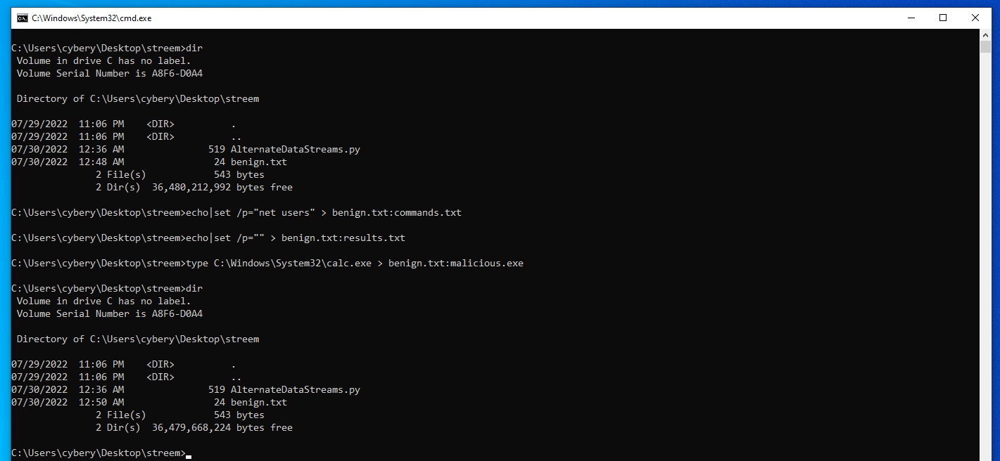
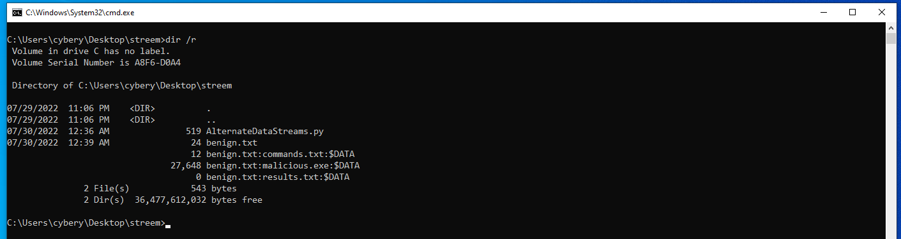
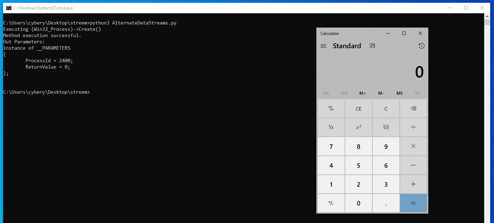
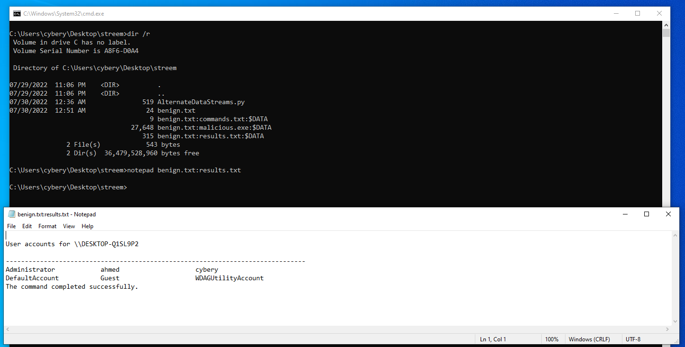

## Table of contents

<!--ts-->
* [Introduction](##Introduction)
* [Create-files-with-alternate-data-stream](##Create-files-with-alternate-data-stream)
* [Execution](##Execution)
* [References](##References)

<!--te-->

## Introduction

Alternate Data Streams (ADS) are a file attribute only found on the NTFS file system, as the name suggests, that are associated with a file but aren't precisely visible. They're built into one particular file, but many of the different tools that we could use to look at a particular file's contents, we'll see it or execute it on the terminal, etc. For an example of this, in our Python code where we're going to be working with alternate data streams are decoy file or the benign file that we're going to be hiding additional content in is called benign.txt.  

## Create files with alternate data stream

So let's create a simple text file called `benign.txt` with the content `This is a benign file`.
```
C:\Users\cybery\Desktop\streem>echo This is a benign file > benign.txt

C:\Users\cybery\Desktop\streem>type benign.txt
This is a benign file
```
Also, our Python code AlternateDataStreams.py where we're going to be working with alternate data streams are decoy file or the benign file that we're going to be hiding additional content in is called benign.txt. 
```
import os

def buildADSFilename(filename,streamname):
	return filename+":"+streamname

decoy = "benign.txt"
resultfile = buildADSFilename(decoy,"results.txt")
commandfile = buildADSFilename(decoy,"commands.txt")

# Run commands from file
with open(commandfile,"r") as c:
    for line in c:
        str(os.system(line + " >> " + resultfile))

# Run executable
exefile = "malicious.exe"
exepath = os.path.join(os.getcwd(),buildADSFilename(decoy,exefile))
os.system("wmic process call create "+exepath)
```
Now if you run `dir` command will see only this command, so to create an alternate data stream we can use echo or type on cmd, the syntax of the data stream is the `<file_name>:<alternate_data_stream_file>`

To create commands.txt `echo|set /p="net users" > benign.txt:commands.txt` ,results.txt `echo|set /p="" > benign.txt:results.txt`
and malicious.exe malicious.exe will be cal.exe for this demonstration. `type C:\Windows\System32\calc.exe > benign.txt:malicious.exe`



As you can see we are not able to see the alternate data stream files using `dir`, for that we should use `dir` with `R` option `dir /R`.



## Execution

What we're going to do with these in our Python script is read the command file, iterate over the lines in it, running those commands. Then put the results of executing them in the result.txt file. If you want real world use case for this, maybe you're attempting to collect data about a user on a system. You might have a key logger installed or have commands that can look for passwords that are cached within browsers or other sensitive data stored on the system. 

We have malicious.exe, and so despite the fact that this particular program is hiding in an alternate data stream and it's not as easily found on the file system, this doesn't mean that we can't access this alternate data stream. All we need is the ability to properly provide its filename, similar to what we did up here with command.txt file and result.txt file. What we use is a simple "BuildADSFilename" function defined here at the top, which essentially creates the file name from the decoy file's name, so benign.txt colon and then the text file or executable that we've stored in that alternate data stream.

We're going to use os.path.join We'll get something like `C:\Users\cybery\Desktop\streem\benign.txt:malicious.exe`We then can use OS system to run WMIC process called create and then provide the path to that particular executable, and what this is going do is it's going to run the executable stored within this alternate data stream.

Now, let's run AlternateDataStreams.py file and absorb the output.



To open results.txt file use notepad as fillowing:



In conclusion, the only way to see alternate data streams is to use `dir` that `slash R` flag, which is intended, in fact, solely for displaying alternate data streams of the file. You have to know that alternate data streams exist and where to look for them to actually identify them on the system, Thank you.

## References
- [Python for Cybersecurity Specialization](https://www.coursera.org/learn/execution-persistence-privilege-escalation-and-evasion/home/welcome){:target="_blank" rel="noopener"}
- [python-for-cybersecurity](https://github.com/hposton/python-for-cybersecurity/tree/main/Part_7/7.2_Hide_Artifacts){:target="_blank" rel="noopener"}
- [Hiding Data Using NTFS Alternate Data Streams (Defence Evasion)](https://www.youtube.com/watch?v=S4MBzeni9Eo&ab_channel=AttackDetectDefend){:target="_blank" rel="noopener"}

##### -------------------------------- I really hope you found this useful. --------------------------------