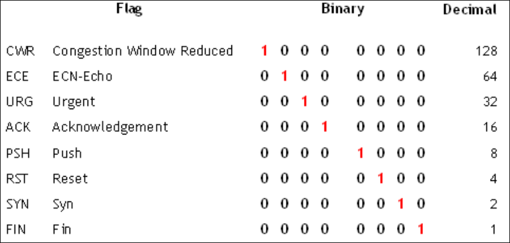
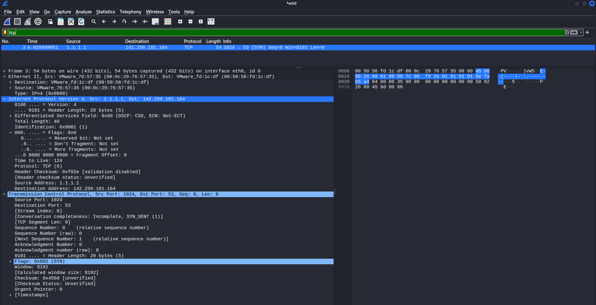
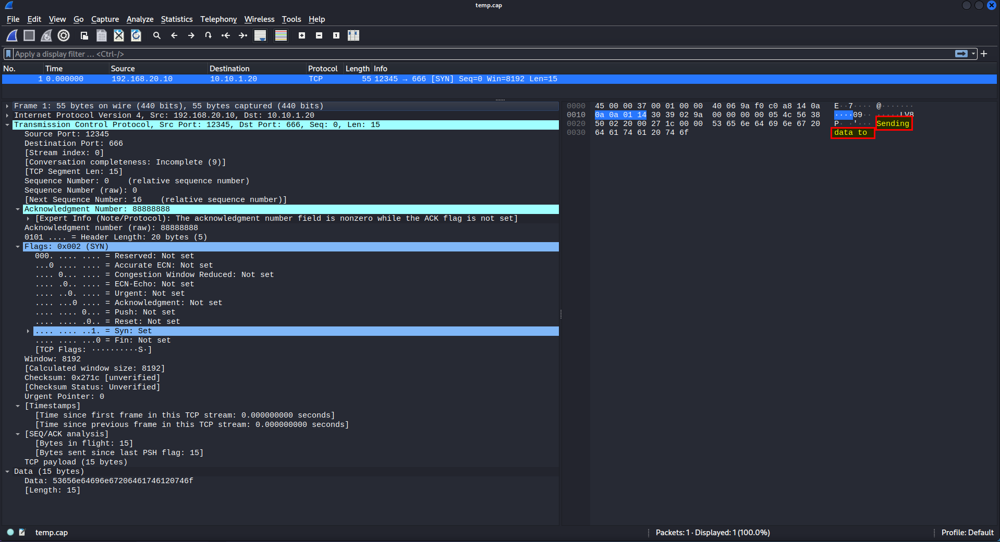

## Table of contents

<!--ts-->
* [Introduction](##Introduction)
* [Scapy-Overview](##Scapy-Overview)
* [Snort-Rule](##Snort-Rule)
* [References](##References)

<!--te-->

## Introduction

In this article will demonstrate how  we can generate packet that can test/trigger rule in Snort or Suricata using Scapy. 

Scapy is a packet manipulation tool for computer networks, originally written in Python by Philippe Biondi. It can forge or decode packets, send them on the wire, capture them, and match requests and replies. It can also handle tasks like scanning, tracerouting, probing, unit tests, attacks, and network discovery.

## Scapy Overview

To run Scapy write scapy in your linux terminal as following:

```bash
┌──(kali㉿kali)-[~]
└─$ sudo scapy
[sudo] password for kali: 

                                      
                     aSPY//YASa       
             apyyyyCY//////////YCa       |
            sY//////YSpcs  scpCY//Pp     | Welcome to Scapy
 ayp ayyyyyyySCP//Pp           syY//C    | Version 2.4.5+g9420c22
 AYAsAYYYYYYYY///Ps              cY//S   |
         pCCCCY//p          cSSps y//Y   | https://github.com/secdev/scapy
         SPPPP///a          pP///AC//Y   |
              A//A            cyP////C   | Have fun!
              p///Ac            sC///a   |
              P////YCpc           A//A   | What is dead may never die!
       scccccp///pSP///p          p//Y   |                     -- Python 2
      sY/////////y  caa           S//P   |
       cayCyayP//Ya              pY/Ya
        sY/PsY////YCc          aC//Yp 
         sc  sccaCY//PCypaapyCP//YSs  
                  spCPY//////YPSps    
                       ccaacs         
                                       using IPython 8.5.0

>>>
```

As we are in programming environment we can use ls() function with object IP to list the IP headers.

```bash
>>> ls(IP)
version    : BitField  (4 bits)                  = ('4')
ihl        : BitField  (4 bits)                  = ('None')
tos        : XByteField                          = ('0')
len        : ShortField                          = ('None')
id         : ShortField                          = ('1')
flags      : FlagsField                          = ('<Flag 0 ()>')
frag       : BitField  (13 bits)                 = ('0')
ttl        : ByteField                           = ('64')
proto      : ByteEnumField                       = ('0')
chksum     : XShortField                         = ('None')
src        : SourceIPField                       = ('None')
dst        : DestIPField                         = ('None')
options    : PacketListField                     = ('[]')

>>> ls(Ether)
dst        : DestMACField                        = ('None')
src        : SourceMACField                      = ('None')
type       : XShortEnumField                     = ('36864')

>>> ls(TCP)
sport      : ShortEnumField                      = ('20')
dport      : ShortEnumField                      = ('80')
seq        : IntField                            = ('0')
ack        : IntField                            = ('0')
dataofs    : BitField  (4 bits)                  = ('None')
reserved   : BitField  (3 bits)                  = ('0')
flags      : FlagsField                          = ('<Flag 2 (S)>')
window     : ShortField                          = ('8192')
chksum     : XShortField                         = ('None')
urgptr     : ShortField                          = ('0')
options    : TCPOptionsField                     = ("b''")
>>>
```

Let's instantiate new IP and assign it to packet.

```bash
>>> packet = IP()
>>> packet
<IP  |> #default IP header
>>> ls(packet)
version    : BitField  (4 bits)                  = 4               ('4')
ihl        : BitField  (4 bits)                  = None            ('None')
tos        : XByteField                          = 0               ('0')
len        : ShortField                          = None            ('None')
id         : ShortField                          = 1               ('1')
flags      : FlagsField                          = <Flag 0 ()>     ('<Flag 0 ()>')
frag       : BitField  (13 bits)                 = 0               ('0')
ttl        : ByteField                           = 64              ('64')
proto      : ByteEnumField                       = 0               ('0')
chksum     : XShortField                         = None            ('None')
src        : SourceIPField                       = '127.0.0.1'     ('None')
dst        : DestIPField                         = '127.0.0.1'     ('None')
options    : PacketListField                     = []              ('[]')
```

What we did here is build that packet and set every thing in it to the default setting.

Now if we want to set any value we can use object-originated programming, So we need to set TTL value to 128 do the following:

```bash
>>> packet.ttl=124
>>> packet
<IP  ttl=124 |>
```

The same thing we can see when running ls(packet), we can see the default on the right side and customize on the left.

```bash
>>> ls(packet)
version    : BitField  (4 bits)                  = 4               ('4')
ihl        : BitField  (4 bits)                  = None            ('None')
tos        : XByteField                          = 0               ('0')
len        : ShortField                          = None            ('None')
id         : ShortField                          = 1               ('1')
flags      : FlagsField                          = <Flag 0 ()>     ('<Flag 0 ()>')
frag       : BitField  (13 bits)                 = 0               ('0')
ttl        : ByteField                           = 124             ('64')
proto      : ByteEnumField                       = 0               ('0')
chksum     : XShortField                         = None            ('None')
src        : SourceIPField                       = '127.0.0.1'     ('None')
dst        : DestIPField                         = '127.0.0.1'     ('None')
options    : PacketListField                     = []              ('[]')
```

For src and dst ip address we need to put them in quotes (””) 

```bash
>>> packet.src="1.1.1.1"
>>> packet.dst="www.google.com"
>>> ls(packet)
version    : BitField  (4 bits)                  = 4               ('4')
ihl        : BitField  (4 bits)                  = None            ('None')
tos        : XByteField                          = 0               ('0')
len        : ShortField                          = None            ('None')
id         : ShortField                          = 1               ('1')
flags      : FlagsField                          = <Flag 0 ()>     ('<Flag 0 ()>')
frag       : BitField  (13 bits)                 = 0               ('0')
ttl        : ByteField                           = 124             ('64')
proto      : ByteEnumField                       = 0               ('0')
chksum     : XShortField                         = None            ('None')
src        : SourceIPField                       = '1.1.1.1'       ('None')
dst        : DestIPField                         = Net("www.google.com/32") ('None')
options    : PacketListField                     = []              ('[]')
>>> packet
<IP  ttl=124 src=1.1.1.1 dst=Net("www.google.com/32") |>
```

Now we want to create a TCP header and assign it to tcp variable.

```bash
>>> tcp=TCP()
>>> tcp
<TCP  |>
>>> ls(tcp)
sport      : ShortEnumField                      = 20              ('20')
dport      : ShortEnumField                      = 80              ('80')
seq        : IntField                            = 0               ('0')
ack        : IntField                            = 0               ('0')
dataofs    : BitField  (4 bits)                  = None            ('None')
reserved   : BitField  (3 bits)                  = 0               ('0')
flags      : FlagsField                          = <Flag 2 (S)>    ('<Flag 2 (S)>')
window     : ShortField                          = 8192            ('8192')
chksum     : XShortField                         = None            ('None')
urgptr     : ShortField                          = 0               ('0')
options    : TCPOptionsField                     = []              ("b''")
```

To change the source port to 1024 and destination port to 53 will do the following:

```bash
>>> tcp.sport=1024
>>> tcp.dport=53
```

For flags you must know the decimal value of each flag, to set SYN flag:

```bash
>>> tcp.flags=0x02
>>> tcp
<TCP  sport=1024 dport=domain flags=S |>
```



To stack the IP header and TCP header together do the following:

```bash
>>> stack = packet/tcp
>>> stack
<IP  frag=0 ttl=124 proto=tcp src=1.1.1.1 dst=Net("www.google.com/32") |<TCP  sport=1024 dport=domain flags=S |>>
```

If you want access any object we can use 

```bash
>>> stack.ttl
124
```

But if flag is in both headers you should use the following:

```bash
>>> stack.getlayer("IP").flags
<Flag 0 ()>
>>> stack.getlayer("TCP").flags
<Flag 2 (S)>
```

To send the packet use:

```bash
>>> send(stack)
.
Sent 1 packets.
```



In this case, Scapy will take care of the Ethernet header, however, you can customize that to Do your research!

It is often useful to save capture packets to pcap file for use at a later time or with different applications:

```bash
>>> wrpcap("/tmp/temp.cap",stack)
```

## Snort Rule

Assume that we wrote the following rule and we need to test/trigger it.

```bash
alert tcp $HOME_NET 12345 -> $EXTERNAL_NET 666 (msg: "SYNISTER command and control"; seq: 0; ack: 88888888; flags: S; content: "Sending data to"; offset:0; sid: 6666666;)
```

Lets write Scapy packet to trigger this rule and save it to /tmp/temp.pcap

```bash
>>> ip = IP()
>>> tcp = TCP()
>>> ls(ip)
version    : BitField  (4 bits)                  = 4               ('4')
ihl        : BitField  (4 bits)                  = None            ('None')
tos        : XByteField                          = 0               ('0')
len        : ShortField                          = None            ('None')
id         : ShortField                          = 1               ('1')
flags      : FlagsField                          = <Flag 0 ()>     ('<Flag 0 ()>')
frag       : BitField  (13 bits)                 = 0               ('0')
ttl        : ByteField                           = 64              ('64')
proto      : ByteEnumField                       = 0               ('0')
chksum     : XShortField                         = None            ('None')
src        : SourceIPField                       = '127.0.0.1'     ('None')
dst        : DestIPField                         = '127.0.0.1'     ('None')
options    : PacketListField                     = []              ('[]')
>>> ip.src = "192.168.20.10"
>>> ip.dst = "10.10.1.20"
>>> tcp.sport=12345
>>> tcp.dport=666
>>> ls(tcp)
sport      : ShortEnumField                      = 12345           ('20')
dport      : ShortEnumField                      = 666             ('80')
seq        : IntField                            = 0               ('0')
ack        : IntField                            = 0               ('0')
dataofs    : BitField  (4 bits)                  = None            ('None')
reserved   : BitField  (3 bits)                  = 0               ('0')
flags      : FlagsField                          = <Flag 2 (S)>    ('<Flag 2 (S)>')
window     : ShortField                          = 8192            ('8192')
chksum     : XShortField                         = None            ('None')
urgptr     : ShortField                          = 0               ('0')
options    : TCPOptionsField                     = []              ("b''")
>>> tcp.seq = 0
>>> tcp.ack = 88888888
>>> tcp.flags=0x02
>>> 
>>> packet = ip/tcp/"Sending data to" #Add data to packet
>>> packet
<IP  frag=0 proto=tcp src=192.168.20.10 dst=10.10.1.20 |<TCP  sport=12345 dport=666 seq=0 ack=88888888 flags=S |<Raw  load='Sending data to' |>>>
>>> wrpcap("/tmp/temp.cap",packet)  #Write our packet to /tmp/temp.pcap

```


Run your Snort and test our generated pcap.

```bash
cybery@idsips:/etc/snort/rules$ snort -A console -q -K none -r /tmp/temp.cap -c local.rules 
11/14-07:41:46.336214  [**] [1:6666666:1] SYNISTER command and control [**] [Priority: 0] {TCP} 192.168.20.10:12345 -> 10.10.1.20:666
```

where our local.rules is the following:

```bash
# $Id: local.rules,v 1.11 2004/07/23 20:15:44 bmc Exp $
# ----------------
# LOCAL RULES
# ----------------
# This file intentionally does not come with signatures.  Put your local
# additions here.
ipvar HOME_NET 192.168.20.0/24
ipvar EXTERNAL_NET !$HOME_NET 
#alert icmp any any -> $HOME_NET any (msg:"ICMP Ping Detected"; sid:100001; rev:1;)
#alert tcp any any -> $HOME_NET 22 (msg:"SSH Authintication Attemp"; sid:100002; rev:1;)
alert tcp $HOME_NET 12345 -> $EXTERNAL_NET 666 (msg: "SYNISTER command and control"; seq: 0; ack: 88888888; flags: S; content: "Sending data to"; offset:0; sid: 6666666; rev:1)
```

We can see that snort is trigger the temp.pcap file according to the rule.

This is a quick demonstration of how we can draft packet to test or trigger specific rule in snort using Scapy.

## References
- [Scapy](https://scapy.net/){:target="_blank" rel="noopener"}
- [The Art of Packet Crafting with Scapy](https://0xbharath.github.io/art-of-packet-crafting-with-scapy/index.html){:target="_blank" rel="noopener"}
- [Snort](https://www.snort.org/){:target="_blank" rel="noopener"}


##### -------------------------------- I really hope you found this useful. --------------------------------