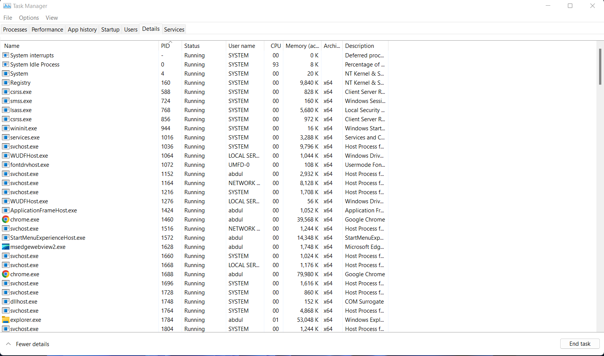

## Table of contents

<!--ts-->
* [Introduction](##Introduction)
* [System](##Scapy-Overview)
* [smss.exe (Session Manager Subsystem)](##smss.exe-(Session-Manager-Subsystem))
* [csrss.exe (Client Server Runtime Process)](##csrss.exe-(Client-Server-Runtime-Process))
* [wininit.exe (Windows Initialization Process)](##wininit.exe-(Windows-Initialization-Process))
* [services.exe Service Control Manager (SCM)](##services.exe-Service-Control-Manager-(SCM))
* [svchost.exe Service Host](##svchost.exe-Service-Host)
* [lsass.exe Local Security Authority Subsystem Service](lsass.exe-Local-Security-Authority-Subsystem-Service)
* [winlogon.exe Windows Logon](winlogon.exe-Windows-Logon)
* [explorer.exe Windows Explorer](explorer.exe-Windows-Explorer)
* [References](##References)

<!--te-->

## Introduction

This article aims to help you know and understand what normal behavior within a Windows operating system is.

## System

The first Windows process on the list is System. We know that a PID is assigned at random to the process, but that is not the case for the System process.
The PID for system is always 4.

The System process (process ID 4) is the home for a special kind of thread that runs only in kernel mode a kernel-mode system thread. System threads have all the attributes and contexts of regular user-mode threads (such as a hardware context, priority, and so on) but are different in that they run only in kernel-mode executing code loaded in system space, whether that is in Ntoskrnl.exe or in any other loaded device driver. In addition, system threads don't have a user process address space and hence must allocate any dynamic storage from operating system memory heaps, such as a paged or nonpaged pool. 

#####  what is normal and abnormal behaviour for this process? 

|   Normal Behaviour   |   Abnormal Behaviour   |
|----------|:-------------:|
| Image Path:  N/A or C:\Windows\system32\ntoskrnl.exe (NT OS Kernel) | Image Path: Other |
| Parent Process:  None or System Idle Process (0)| A parent process (aside from System Idle Process (0)) |
| Process PID 4 | A different PID. (Remember that the PID will always be PID 4) |
| Number of Instances:  One | Multiple instances of System. (Should only be one instance) |
| User Account:  Local System | User Account:  Not local System |
| Start Time:  At boot time | Start Time: Not at boot time  |
| Running in Session 0 | Not running in Session 0 |

## smss.exe (Session Manager Subsystem)

This process, also known as the Windows Session Manager, is responsible for creating new sessions.

This process starts the kernel and user modes of the Windows subsystem.

Smss.exe starts csrss.exe (Windows subsystem) and wininit.exe in Session 0, an isolated Windows session for the operating system, and csrss.exe and winlogon.exe for Session 1, which is the user session. The first child instance creates child instances in new sessions, done by smss.exe copying itself into the new session and self-terminating. 

SMSS is also responsible for creating environment variables, virtual memory paging files and starts winlogon.exe (the Windows Logon Manager).

#####  what is normal and abnormal behaviour for this process? 

|   Normal Behaviour   |   Abnormal Behaviour   |
|----------|:-------------:|
| Image Path:  %SystemRoot%\System32\smss.exe | The image path is different from C:\Windows\System32 |
| Parent Process:  System | A different parent process other than System (4) |
| Number of Instances:  One master instance and child instance per session. The child instance exits after creating the session. | More than one running process. (children self-terminate and exit after each new session) |
| User Account:  Local System | The running User is not the SYSTEM user |
| Start Time:  Within seconds of boot time for the master instance | Start Time: - |
|  | Unexpected registry entries for Subsystem |

## csrss.exe (Client Server Runtime Process)

This process is responsible for the Win32 console window and process thread creation and deletion.

This process is also responsible for making the Windows API available to other processes, mapping drive letters, and handling the Windows shutdown process.

#####  what is normal and abnormal behaviour for this process? 

|   Normal Behaviour   |   Abnormal Behaviour   |
|----------|:-------------:|
| Image Path:  %SystemRoot%\System32\csrss.exe | Image file path other than C:\Windows\System32 |
| Parent Process:  Created by an instance of smss.exe | An actual parent process. (smss.exe calls this process and self-terminates)) |
| Number of Instances:  Two or more | Subtle misspellings to hide rogue processes masquerading as csrss.exe in plain sight |
| User Account:  Local System | The user is not the SYSTEM user. |
| Start Time:  Within seconds of boot time for the first two instances (for Session 0 and 1). Start times for additional instances occur as new sessions are created, although only Sessions 0 and 1 are often created. | |

## wininit.exe (Windows Initialization Process)
 wininit.exe is responsible for launching services.exe (Service Control Manager), lsass.exe (Local Security Authority), and lsaiso.exe within Session 0. It is another critical Windows process that runs in the background, along with its child processes. 

Note: lsaiso.exe is a process associated with Credential Guard and KeyGuard. You will only see this process if Credential Guard is enabled. 

#####  what is normal and abnormal behaviour for this process? 

|   Normal Behaviour   |   Abnormal Behaviour   |
|----------|:-------------:|
| Image Path:  %SystemRoot%\System32\wininit.exe | Image file path other than C:\Windows\System32 |
| Parent Process:  Created by an instance of smss.exe | An actual parent process. (smss.exe calls this process and self-terminates) |
| Number of Instances:  One | Multiple running instances |
| User Account:  Local System | Not running as SYSTEM |
| Start Time:  Within seconds of boot time | |
| | Subtle misspellings to hide rogue processes in plain sight |

## services.exe Service Control Manager (SCM)

Its primary responsibility is to handle system services: loading services, interacting with services and starting or ending services. 

This process is the parent to several other key processes: svchost.exe, spoolsv.exe, msmpeng.exe, and dllhost.exe, to name a few.

#####  what is normal and abnormal behaviour for this process? 

|   Normal Behaviour   |   Abnormal Behaviour   |
|----------|:-------------:|
| Image Path: %SystemRoot%\System32\services.exe | Image file path other than C:\Windows\System32 |
| Parent Process:  wininit.exe | A parent process other than wininit.exe |
| Number of Instances:  One | Multiple running instances |
| User Account:  Local System | Not running as SYSTEM |
| Start Time:  Within seconds of boot time | |
| | Subtle misspellings to hide rogue processes in plain sight |

## svchost.exe Service Host

svchost.exe is responsible for hosting and managing Windows services. 

The services running in this process are implemented as DLLs. The DLL to implement is stored in the registry for the service under the Parameters subkey in ServiceDLL. 

Since svchost.exe will always have multiple running processes on any Windows system, this process has been a target for malicious use. Adversaries create malware to masquerade as this process and try to hide amongst the legitimate svchost.exe processes. They can name the malware svchost.exe or misspell it slightly, such as scvhost.exe. By doing so, the intention is to go under the radar. Another tactic is to install/call a malicious service (DLL).  

#####  what is normal and abnormal behaviour for this process? 

|   Normal Behaviour   |   Abnormal Behaviour   |
|----------|:-------------:|
| Image Path: %SystemRoot%\System32\svchost.exe | Image file path other than C:\Windows\System32 |
| Parent Process:  services.exe | A parent process other than services.exe |
| Number of Instances:  Many | Multiple running instances |
| User Account:  Varies (SYSTEM, Network Service, Local Service) depending on the svchost.exe instance. In Windows 10, some instances run as the logged-in user. |  |
| Start Time: Typically within seconds of boot time. Other instances of svchost.exe can be started after boot. | |
| | Subtle misspellings to hide rogue processes in plain sight |
| | The absence of the -k parameter in the Command line |

## lsass.exe Local Security Authority Subsystem Service

(LSASS) is a process in Microsoft Windows operating systems that is responsible for enforcing the security policy on the system. 

It creates security tokens for SAM (Security Account Manager), AD (Active Directory), and NETLOGON. It uses authentication packages specified in `HKLM\System\CurrentControlSet\Control\Lsa`.

Lsass.exe is another process adversaries target. Common tools such as mimikatz are used to dump credentials, or adversaries mimic this process to hide in plain sight. Again, they do this by either naming their malware by this process name or simply misspelling the malware slightly. 

#####  what is normal and abnormal behaviour for this process? 

|   Normal Behaviour   |   Abnormal Behaviour   |
|----------|:-------------:|
| Image Path: %SystemRoot%\System32\lsass.exe | Image file path other than C:\Windows\System32 |
| Parent Process:  wininit.exe | A parent process other than wininit.exe |
| Number of Instances: One | Multiple running instances |
| User Account:  Local System | Not running as SYSTEM |
| Start Time: Within seconds of boot time | |
| | Subtle misspellings to hide rogue processes in plain sight |

## winlogon.exe Windows Logon

 winlogon.exe is responsible for handling the Secure Attention Sequence (SAS). It is the ALT+CTRL+DELETE key combination users press to enter their username & password. 

This process is also responsible for loading the user profile. It loads the user's NTUSER.DAT into HKCU, and userinit.exe loads the user's shell.

It is also responsible for locking the screen and running the user's screensaver, among other functions. 

#####  what is normal and abnormal behaviour for this process? 

|   Normal Behaviour   |   Abnormal Behaviour   |
|----------|:-------------:|
| Image Path:  %SystemRoot%\System32\winlogon.exe | Image file path other than C:\Windows\System32 |
| Parent Process:  Created by an instance of smss.exe that exits, so analysis tools usually do not provide the parent process name. | An actual parent process. (smss.exe calls this process and self-terminates) |
| Number of Instances:  One or more |  |
| User Account:  Local System | Not running as SYSTEM |
| Start Time:  Within seconds of boot time for the first instance (for Session 1). Additional instances occur as new sessions are created, typically through Remote Desktop or Fast User Switching logons. | |
| | Subtle misspellings to hide rogue processes in plain sight |
| | Shell value in the registry other than explorer.exe | 

## explorer.exe Windows Explorer

This process gives the user access to their folders and files. It also provides functionality for other features, such as the Start Menu and Taskbar.

#####  what is normal and abnormal behaviour for this process? 

|   Normal Behaviour   |   Abnormal Behaviour   |
|----------|:-------------:|
| Image Path:  %SystemRoot%\explorer.exe | Image file path other than C:\Windows |
| Parent Process:  Created by userinit.exe and exits | An actual parent process. (userinit.exe calls this process and exits) |
| Number of Instances:  One or more per interactively logged-in user |  |
| User Account:  Logged-in user(s) | Running as an unknown user |
| Start Time:  First instance when the first interactive user logon session begins | |
| | Subtle misspellings to hide rogue processes in plain sight |
| | Outbound TCP/IP connections | 

The Windows processes discussed in this aricle are core processes, and understanding how they usually operate can aid a defender in identifying unusual activity on the endpoint. 

## References
- [Core Windows Processes](https://tryhackme.com/room/btwindowsinternals){:target="_blank" rel="noopener"}
- [Hunt Evil](https://www.sans.org/security-resources/posters/hunt-evil/165/download){:target="_blank" rel="noopener"}
- [Windows Internals Book](https://docs.microsoft.com/en-us/sysinternals/resources/windows-internals){:target="_blank" rel="noopener"}

##### -------------------------------- I really hope you found this useful. --------------------------------